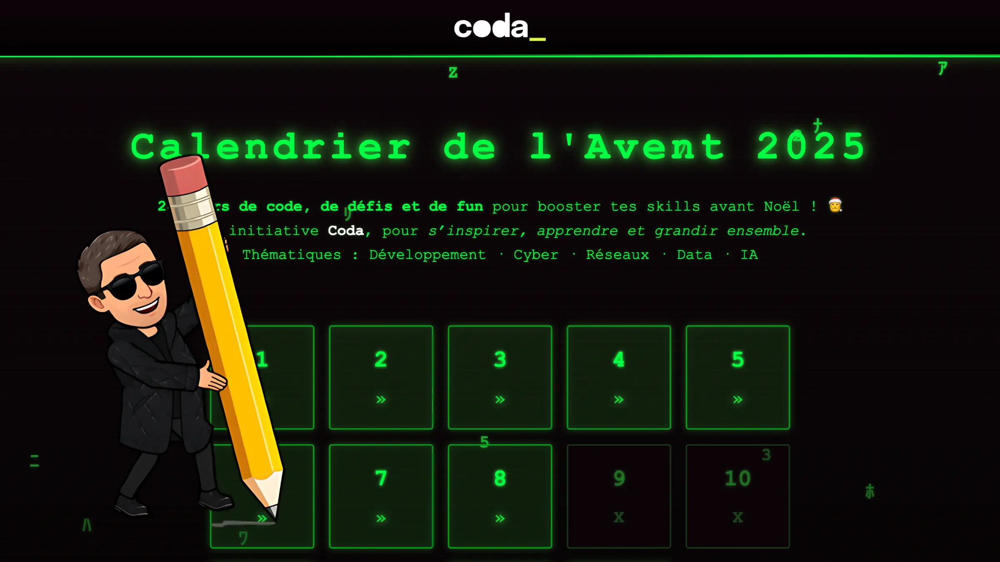

# Calendrier de l'Avent Coda - 2025
Ce repository contient mes résolutions du [calendrier de l'Avent Coda](https://coda-school.github.io/advent-2025/).

| Jour | Proposition                                              |                    |
|------|----------------------------------------------------------|--------------------|
| 01   | [Un curieux message](day-01/README.md)                   | 🐨 `kotlin`        |
| 02   | [Compter les Rennes](day-02/README.md)                   | 🅲️ `C`            | 
| 03   | [Le script fantôme](day-03/README.md)                    | 🐚 `shell`         |
| 04   | [Bataille de biscuits](day-04/README.md)                 | ☕️ `java`          |
| 05   | [Le piège de la date infernale](day-05/README.md)        | 📊 `html, css, js` |
| 06   | [Une histoire de poids](day-06/README.md)                | 🏷️ `typescript`   |
| 07   | [L'imparfait du futur](day-07/README.md)                 | 🍁 `C#`            |
| 08   | [Les 3 enfants les plus sages](day-08/README.md)         | 🧭 `SQL`           |
| 09   | [Une distance en traîneau](day-09/README.md)             | 🐨 `kotlin`        |
| 10   | [La quête du cadeau parfait](day-10/README.md)           | 🐘 `php`           |
| 11   | [Un bug bloque la tournée...](day-11/README.md)          | 🍁`C#`             |
| 12   | [Elfe-ervescence](day-12/README.md)                      | ☕️ `java`          |
| 13   | [La marketplace des Elfes](day-13/README.md)             | N/A                |
| 14   | [Le chemin des cadeaux](day-14/README.md)                | 🦀 `rust`          |
| 15   | [Le code parfait de Nori](day-15/README.md)              | 🏷️ `typescript`   |
| 16   | [Un message secret](day-16/README.md)                    | 💠 `F#`            |
| 17   | [if... elfe... refactor](day-17/README.md)               | ☕️ `java`          |
| 18   | [Le mystère du GQS](day-18/README.md)                    | 🗼 `scala`         |
| 19   | [Le vrai visage du Père Noël](day-19/README.md)          | 📊 `html, css, js` |
| 20   | [Logistique Elfique](day-20/README.md)                   | 🍁 `C#`            |
| 21   | [Démasquer l’elfe malveillant](day-21/README.md)         | 🧭 `SQL`           |
| 22   | [ASCII paraît, on installe le sapin ?](day-22/README.md) | 🏷️ `typescript`   |
| 23   | [Se rendre indispensable !!!](day-23/README.md)          | 🍁 `C#`            |
| 24   | [Un Message du Père Noël](day-24/README.md)              | N/A                |
| 25   | [L’Audit des cadeaux mécontents](day-25/README.md)       | 🥤 `go`            |