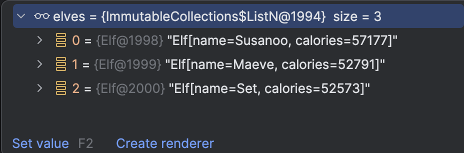

# [Jour 4 — Bataille de biscuits](https://coda-school.github.io/advent-2025/?day=04)
Aujourd'hui nous devons aider Santa à désigner le ou la champion·ne du goûter de Noël parmi les elfes...
Le fichier `data` contient la liste des calories transportées par chaque elfe.

Il est structuré de la manière suivante :

```
// Nom de l'elfe suivi du nombre de calories de chaque gourmandise
Pepin
1000
2000
3000

// Blocs séparés par une ligne vide
Luna
4000

Marius
5000
6000

Nora
7000
8000
9000

Tika
10000
```

Le choix du langage est libre, je vais utiliser `java` avec `junit` ce jour et changerai de langage d'autres jours.

## Étape 1 — parser le fichier

🔴 Je commence par écrire un premier test me permettant de valider que j'arrive à lire le fichier.

```java

@Test
void should_parse_input_correctly() {
    assertThat(FileUtils.getInputAsString("data"))
            .startsWith("Lugh");
}
```

🟢 J'implémente ensuite les méthodes utilitaires :

```java

@UtilityClass
public class FileUtils {
    @SneakyThrows
    public static String getInputAsString(String input) {
        return Files.readString(Path.of(uriFrom(input)));
    }

    private static URI uriFrom(String input) throws URISyntaxException {
        return Objects.requireNonNull(urlFrom(input)).toURI();
    }

    private static URL urlFrom(String input) {
        return FileUtils.class.getClassLoader().getResource(input);
    }
}
```

🔴 Je continue en splittant les données de chaque elf; je pose un autre test :

```java

@Test
void should_parse_input_correctly() {
    assertThat(elfStrings()[1])
            .startsWith("Raijin")
            .endsWith("1625");
}
```

🟢 Puis implémente `elfStrings()` :

```java
public static final String DATA = "data";

private static String emptyLine() {
    return "\\n\\s*\\n";
}

private static String[] elfStrings() {
    return FileUtils.getInputAsString(DATA)
            .split(emptyLine());
}
```

## Étape 2 — structurer la donnée

Afin d'être en capacité de les classer, on va maintenant les structurer en un objet `Elf`.
🔴 On commence par un nouveau test :

```java

@Test
void should_parse_input_to_elf() {
    assertThat(mapElf(elfStrings()[1]))
            .isEqualTo(new Elf("Raijin", 24608));
}
```

🟢 On implémente ensuite la classe `Elf` et la méthode `mapElf` :

```java
// On utilise 1 record pour son immutability et sa value equality
// On va sommer les calories pour chaque elfe
public record Elf(String name, int calories) {
}

private Elf mapElf(String elfString) {
    var parsed = elfString.split("\n");

    return new Elf(
            parsed[0],
            stream(parsed)
                    // Skip le nom de l'elfe et traite les calories
                    .skip(1)
                    .mapToInt(Integer::parseInt)
                    .sum()
    );
}
```

## Étape 3 — identifier le TOP 3

🔴 Vous connaissez la routine, on pose un test :

```java

@Test
void should_find_top_3_elves_by_calories() {
    var elves = top3Elves();
    // On ne connait pas le résultat attendu à moins de travailler sur un sous-enssemble de données
    assertThat(elves.getFirst()).isEqualTo(new Elf("???", 999));
}
```

On peut jouer avec la collection au `runtime` pour vérifier que le TOP 3 est bien le bon :


🟢 On implémente la méthode `top3Elves()` :

```java
private List<Elf> top3Elves() {
    return stream(elfStrings())
            .map(this::mapElf)
            .sorted(comparingInt(Elf::calories)
                    .reversed()
            ).limit(3)
            .toList();
}
```

## Étape 4 — afficher le TOP 3

On finit par l'affichage du TOP 3 comme exposé dans la mission :

```java
private void displayWinner(List<Elf> elves) {
    out.println("🍪 Elf of the Day: " + elves.getFirst().name() + " with " + elves.getFirst().calories() + " calories!");
    out.println("🥈 Then comes " + elves.get(1).name() + " (" + elves.get(1).calories() + ") and " + elves.get(2).name() + " (" + elves.get(2).calories() + ")");
    out.println("🎁 Combined snack power of Top 3: " + elves.stream().mapToInt(Elf::calories).sum() + " calories!");
}
```

Ce qui donne :

```
🍪 Elf of the Day: Susanoo with 57177 calories!
🥈 Then comes Maeve (52791) and Set (52573)
🎁 Combined snack power of Top 3: 162541 calories!
```