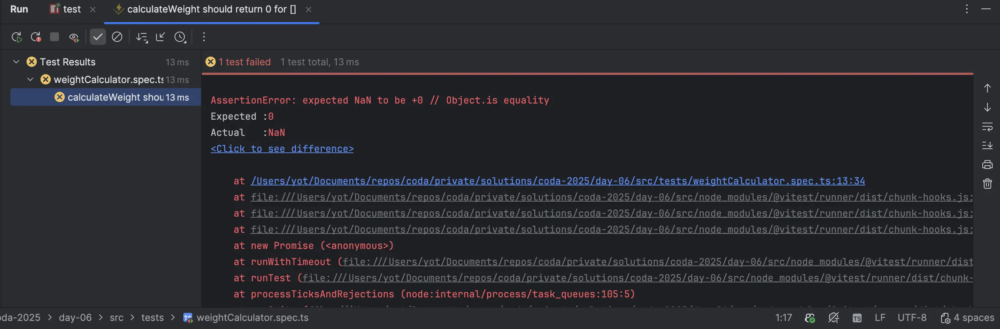
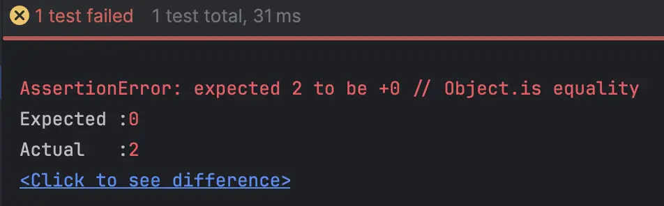
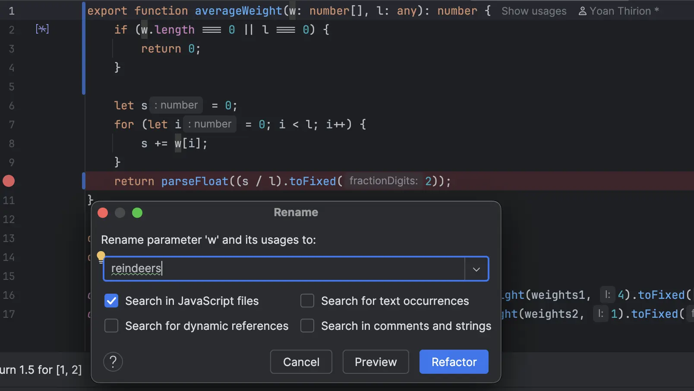
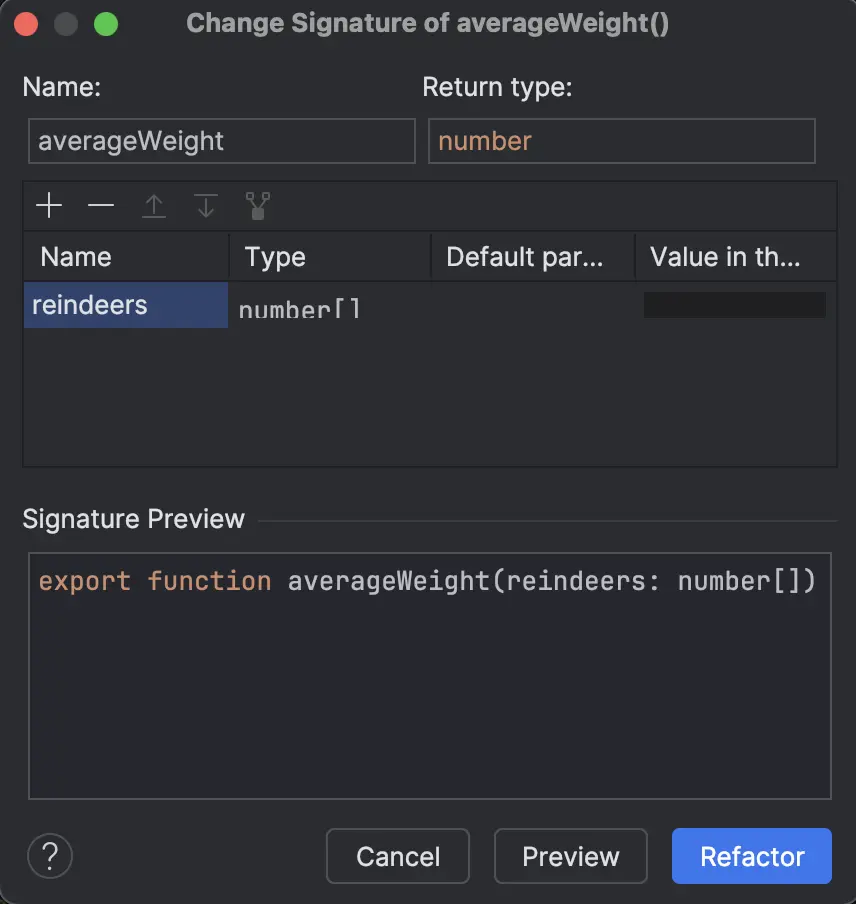

# [Jour 6 — Une histoire de poids](https://coda-school.github.io/advent-2025/?day=06)
Il va falloir écrire des tests unitaires pour décrire le comportement attendu de la fonction `averageWeight`.

L'elfe Julian nous a fourni quelques cas de test à implémenter :

```text
- {2, 5, 7, 10} -> 6.00
- {2} -> 2.00
- {} -> 0.00
- {1, 2} -> 1.50
```

Au vu de la note du Chef Qualité, on peut supposer que la fonction actuelle ne gère pas correctement certains cas...

> *Note du Chef Qualité* : “Un test qui échoue avant la correction, c’est un cadeau : il révèle une vérité qu’on ne voyait pas.” 🎄

On a le choix entre 3 langages pour ce jour : `C`, `java` ou `ts`.
Je vais partir sur `ts` pour ce challenge (c'est celui que je n'ai pas encore utilisé).

## Étape 1 — écrire les tests unitaires

On commence par ajouter la dépendance sur [vitest](https://vitest.dev/) et le script de test dans le `package.json` :

```json
{
  ...
  "devDependencies": {
    "vitest": "^3.2.4"
  },
  "scripts": {
    "start": "tsc && node src/weightCalculator.js",
    "test": "vitest"
  }
  ...
}
```

Ensuite, on crée un fichier `weightCalculator.spec.ts` pour y mettre nos tests.
On ajoute le premier test qui passe directement :

```typescript
test('calculateWeight should return 6 for [2, 5, 7, 10]', () => {
    // Vu l'implémentation de la fonction le second paramètre est la longueur du tableau
    expect(averageWeight([2, 5, 7, 10], 4)).toBe(6);
})
```

On enchaine avec les autres cas de test :

```typescript
// celui-ci passe ✅
test('calculateWeight should return 2 for [2]', () => {
    expect(averageWeight([2], 1)).toBe(2);
})

// celui-ci échoue ❌
test('calculateWeight should return 0 for []', () => {
    expect(averageWeight([], 1)).toBe(0);
})
```

Voici le message d'erreur obtenu :


On fixe ce premier problème en modifiant la fonction `averageWeight` pour gérer le cas où le tableau est vide :

```typescript
export function averageWeight(w: number[], l: any): number {
    if (w.length === 0 || l === 0) {
        return 0;
    }
...
}
```

Et maintenant, on ajoute le dernier test ({1, 2} -> 1.50) qui échoue également...


Effectivement tout est géré sous forme d'`int` dans la fonction, il faut donc forcer la division en `float` :

```typescript
export function averageWeight(w: number[], l: any): number {
    if (w.length === 0 || l === 0) {
        return 0;
    }

    let s = 0;
    for (let i = 0; i < l; i++) {
        s += w[i];
    }
    return parseFloat((s / l).toFixed(2));
}
```

## Étape 2 — refactoring

Maintenant que tous les tests passent, on peut se pencher sur le refactoring de la fonction.

On peut commencer par le renommage en utilisant les refactorings automatisés de notre IDE :


```typescript
export function averageWeight(reindeers: number[], numberOfReindeers: any): number {
    if (reindeers.length === 0 || numberOfReindeers === 0) {
        return 0;
    }

    let weight = 0;
    for (let i = 0; i < numberOfReindeers; i++) {
        weight += reindeers[i];
    }
    return parseFloat((weight / numberOfReindeers).toFixed(2));
}
```

On va revoir les paramètres également via `change signature` :


```typescript
export function averageWeight(reindeers: number[]): number {
    const numberOfReindeers = reindeers.length;
    if (reindeers.length === 0 || numberOfReindeers === 0) {
        return 0;
    }

    let weight = 0;
    for (let i = 0; i < numberOfReindeers; i++) {
        weight += reindeers[i];
    }
    return parseFloat((weight / numberOfReindeers).toFixed(2));
}
```

On itère sur le code et on utilise la fonction `reduce` :

```typescript
const isValid = (reindeers: number[]) => reindeers != null && reindeers.length > 0;
const sumWeight = (reindeers: number[]) => reindeers.reduce((acc, weight) => acc + weight, 0);

export function averageWeight(reindeers: number[]): number {
    if (!isValid(reindeers)) {
        return 0;
    }
    return parseFloat(
        (sumWeight(reindeers) / reindeers.length).toFixed(2)
    );
}
```

On a de la duplication dans les tests qu'on va pouvoir retirer via l'utilisation des [tests paramétrisés](https://vitest.dev/api/#test-each) :
```typescript
test.each([
    {reindeers: [2, 5, 7, 10], expected: 6},
    {reindeers: [2], expected: 2},
    {reindeers: [], expected: 0},
    {reindeers: [1, 2], expected: 1.5},
    {reindeers: null, expected: 0},
])('calculateWeight should return $expected for $reindeers', ({reindeers, expected}) => {
    expect(averageWeight(reindeers)).toBe(expected);
});
```