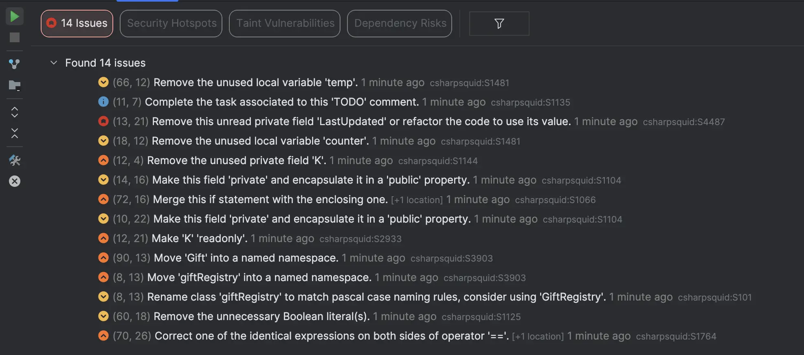
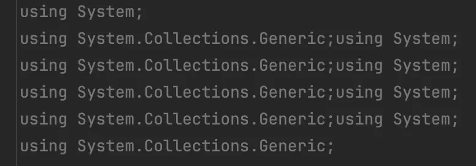
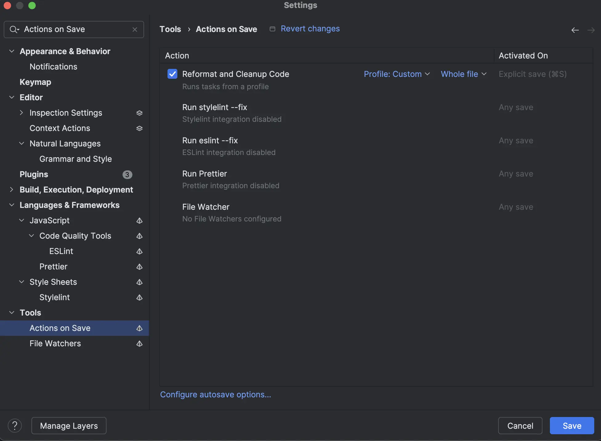
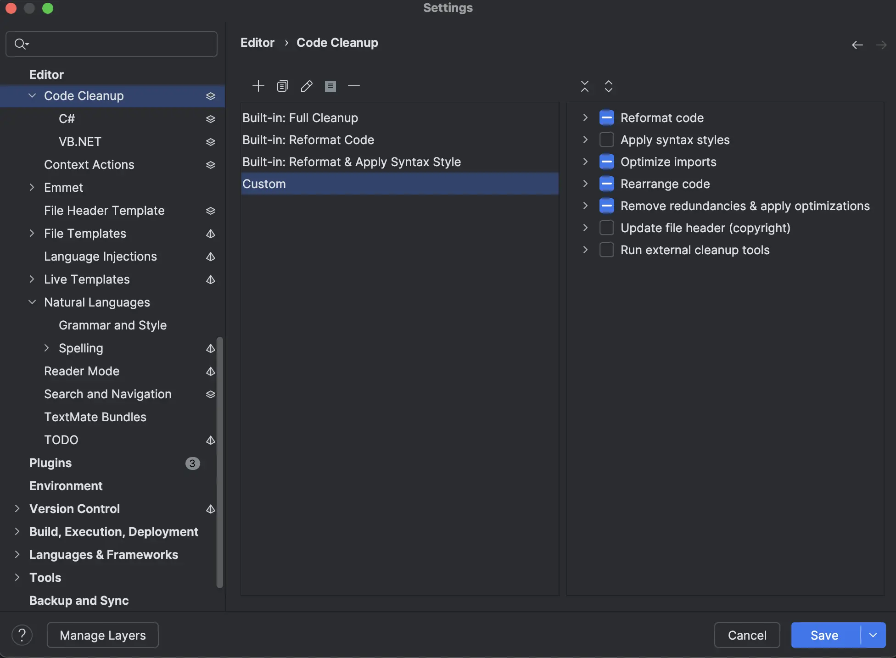
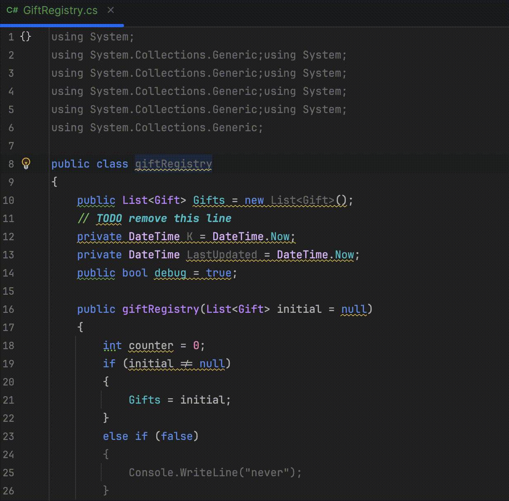

# [Jour 7 — L'imparfait du futur](https://coda-school.github.io/advent-2025/?day=07)
Aujourd'hui le challenge semble tourner autour de la qualité du code et comment la "mesurer".

- Choisis ton **linter** selon le langage : **TypeScript** → [ESLint](https://eslint.org) (+ plugin `@typescript-eslint`), **C# / PHP / Java** → [SonarLint](https://www.sonarsource.com/products/sonarlint/)
- **Lance l’analyse** du code que les elfes t’ont envoyé (même logique dans les 4 langages)
- **Dresse la liste** des problèmes détectés (règle, niveau, explication)
- **Corrige** les erreurs et “code smells” pour que les linters passent au vert.

## Étape 1 : choisir son Linter
Avant d'en utiliser un, voici quelques ressources intéressantes pour comprendre ce que c'est et à quoi cela peut servir :
- [Logiciel Lint](https://fr.wikipedia.org/wiki/Lint_(logiciel))
- [Le linting, une bonne pratique !](https://mindsers.blog/fr/post/linting-good-practices/)

Voici une mini-définition facile à retenir :
> Un linter, abréviation de linter de code ou analyseur de code statique, est un outil d'analyse statique qui examine le code source pour identifier d'éventuels problèmes, le respect des normes de codage et la cohérence du style.

En ce qui concerne mon choix, je vais partir sur `C#` avec [SonarLint](https://www.sonarsource.com/fr/products/sonarlint/).

## Étape 2 : lancer l'analyse
Une fois installé, on peut simplement utilisé le `Linter` sur notre projet et analyser ses découvertes :



## Étape 3 : dresser la liste des problèmes
Il y a `14 issues` identifiés et les principaux problèmes sont :
- Des variables déclarées mais non utilisées
- 1 `TODO` qui traine
- Des problèmes d'accessibilité : 
  - des variables `public` qui ne devraient pas l'être
  - des propriétés qui devraient être `readonly`
- Pas de `namespace` nommés
- Des problèmes de Casse `giftRegistry` comme nom de classe par exemple

## Étape 4 : corriger ce qui est identifié
C'est l'étape la plus fun 😉

Nous allons utiliser le `Linter` afin de guider nos actions. Il va nous servir de `Driver` d'implémentation.
Le fait d'arriver à 0 `issues` est notre objectif.

Avant d'y aller, il y a des problèmes qui sont relevés par mon `IDE` (ici `Rider`) qui ne sont pas vus par le Linter :
Les `using` non utilisés par exemple ici : 



Ce que je trouve toujours intéressant c'est d'automatiser certains "Nettoyages" avec nos outils de développement.
Ici ils seront nettoyés automatiquement au moment de la sauvegarde.

Pour ce faire, on peut automatiser certains traitements au moment de la sauvegarde par exemple (via `Actions On Save`)


Voici les options configuréés derrière :


Maintenant qu'on a configuré notre `IDE`, allons-y pour le grand ménage :

- On commence par renommer la classe


- On ajoute un `namespace`
    - Ces 2 actions redescendent le nombre d'issues à 11

```csharp
namespace Registry;
public class GiftRegistry
...
```

- Après quelques [refactorings automatisés](img/automated-refactoring.mp4), on obtient :

```csharp
public class GiftRegistry
{
    private readonly List<Gift> _gifts = [];
    private const bool Debug = true;

    public GiftRegistry(List<Gift>? initial = null)
    {
        if (initial != null) _gifts = initial;
    }

    public void AddGift(string child, string gift, bool? packed = null)
    {
        if (child == "")
        {
            Console.WriteLine("child missing");
        }

        var duplicate = _gifts.Find(g => g.ChildName == child && g.GiftName == gift);
        if (duplicate == null)
        {
            _gifts.Add(new Gift(child, gift, packed, "ok"));
        }
    }

    public bool MarkPacked(string child)
    {
        var found = false;
        foreach (var g in _gifts)
        {
            if (g.ChildName == child)
            {
                g.IsPacked = true;
                found = true;
                break;
            }
        }

        return found;
    }

    public Gift? FindGiftFor(string child)
    {
        Gift? result = null;
        _gifts.ForEach(g =>
        {
            if (g.ChildName == child) result = g;
        });
        return result;
    }

    public int ComputeElfScore()
    {
        var score = _gifts.Sum(g => (g.IsPacked == true ? 7 : 3) + (!string.IsNullOrEmpty(g.Notes) ? 1 : 0) + 42);
        if (Debug) Console.WriteLine($"score: {score}");
        return score;
    }
}

public record Gift(string ChildName, string GiftName, bool? IsPacked, string Notes)
{
    public string ChildName { get; set; } = ChildName;
    public string GiftName { get; set; } = GiftName;
    public bool? IsPacked { get; set; } = IsPacked;
    public string Notes { get; set; } = Notes;
}
```

Notre `Linter` ne remonte plus d'issues et pourtant...

Nous avons 1 `boolean` à 3 états dans le code : `bool? IsPacked` (null | false | true).
Après quelques refactorings, on finit avec :

```csharp
public class GiftRegistry
{
    private readonly List<Gift> _gifts = [];
    private const bool Debug = true;

    public GiftRegistry(List<Gift>? initial = null)
    {
        if (initial != null) _gifts = initial;
    }

    public void AddGift(string child, string gift, bool packed = false)
    {
        if (child == string.Empty) Log("child missing");

        if (!DoesGiftExistFor(child, gift))
        {
            _gifts.Add(new Gift(child, gift, packed, "ok"));
        }
    }

    private bool DoesGiftExistFor(string child, string gift)
        => _gifts.Exists(g => g.ChildName == child && g.GiftName == gift);

    public bool MarkPacked(string child)
    {
        var giftsForChild = _gifts.Where(g => g.ChildName == child).ToList();
        giftsForChild.ForEach(g => g.IsPacked = true);

        return giftsForChild.Count != 0;
    }

    public Gift? FindGiftFor(string child)
        => _gifts.FirstOrDefault(g => g.ChildName == child);

    public int ComputeElfScore()
    {
        var score = SumGifts();
        if (Debug) Log($"score: {score}");

        return score;
    }

    private int SumGifts() => _gifts.Sum(g => (g.IsPacked ? 7 : 3) + (!string.IsNullOrEmpty(g.Notes) ? 1 : 0) + 42);
    private static void Log(string message) => Console.WriteLine(message);
}

public record Gift(string ChildName, string GiftName, bool IsPacked, string Notes)
{
    public string ChildName { get; } = ChildName;
    public string GiftName { get; } = GiftName;
    public bool IsPacked { get; set; } = IsPacked;
    public string Notes { get; } = Notes;
}
```

J'espère que les elfes seront contents de l'usage des `Linters` et qu'ils y verront une aide précieuse dans leur quotidien 😉
