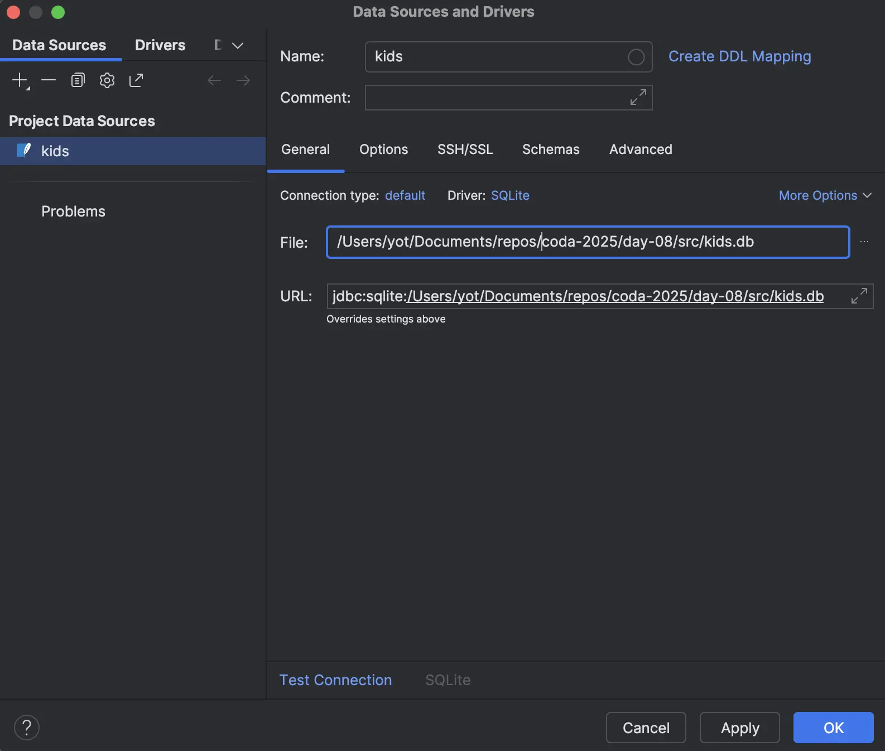
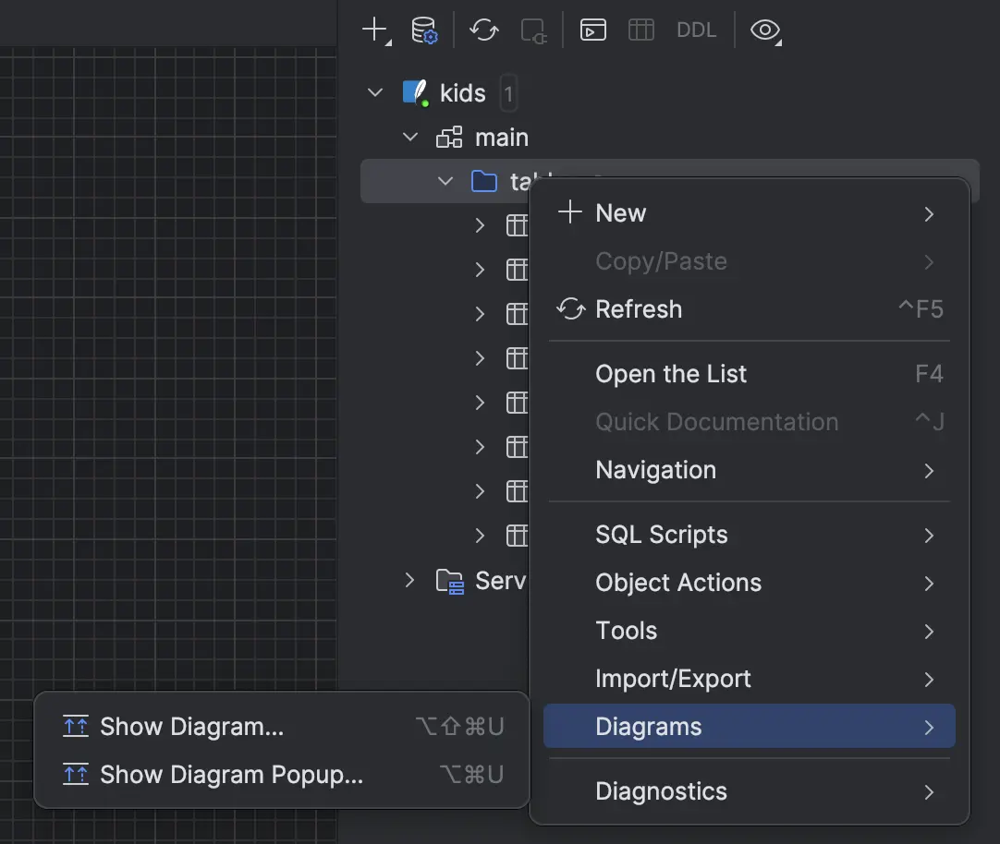
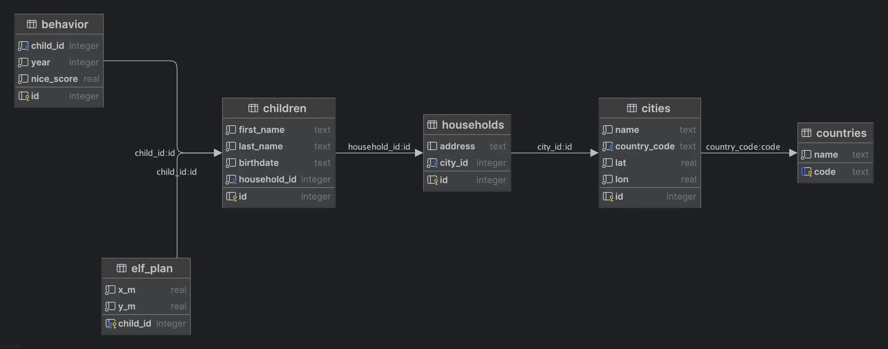
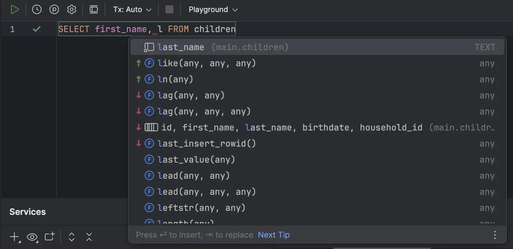
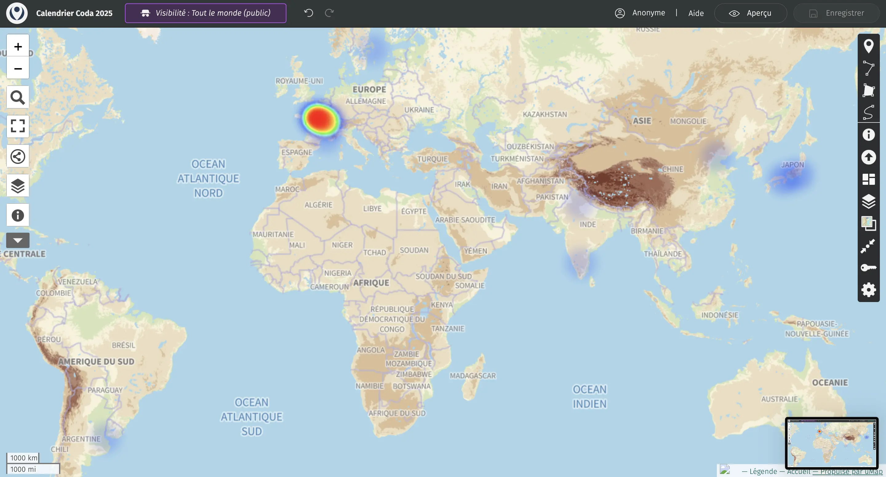
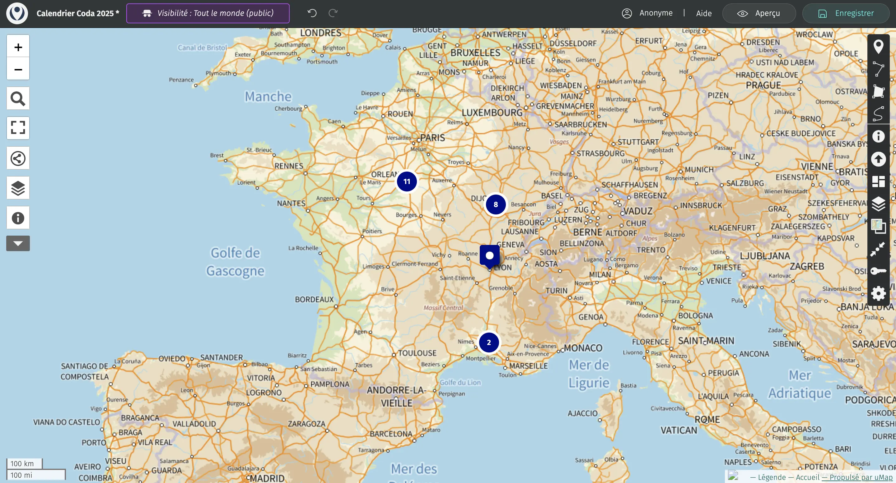

# [Jour 8 — Les 3 enfants les plus sages](https://coda-school.github.io/advent-2025/?day=08)
Aujourd'hui le challenge tourne autour de l'extraction d'un `TOP 3` d'enfants sages ainsi que leurs localisations à partir de la base de données elfique. 

Nos amis les elfes ont décris les tables comme suit :
- `countries(code, name)`
- `cities(id, name, country_code, lat, lon)`
- `households(id, address, city_id)`
- `children(id, first_name, last_name, birthdate, household_id)`
- `behavior(id, child_id, year, nice_score)` — scores de sagesse 2025
- `elf_plan(child_id, x_m, y_m)` — coordonnées

## Étape 1 : extraire le **Top 3**
Je vais utiliser les outils `Database` embarqués dans mon `IDE` pour résoudre ce challenge.

- On commence par configurer une nouvelle `Datasource` :



- Ensuite, on peut générer un `Diagram` permettant de mieux comprendre les relations :



- Cela nous donne ce résultat, nous permettant de facilement comprendre la structure de la base :



- On commence à "jouer" avec les données, notre éditeur nous aide dans la découverte des champs / tables



```sql
SELECT first_name, last_name
FROM children
```

- Afin d'identifier l'enfant le plus sage on voit qu'il va falloir passer par la table `behavior`
  - Le `nice_score` semble être 1 score sur 100

```sql
SELECT first_name, last_name, nice_score FROM children
INNER JOIN behavior ON children.id = behavior.child_id
ORDER BY nice_score DESC
```

- Voici le résultat de cette requête :

| first_name | last_name | nice_score |
|:-----------|:----------|:-----------|
| Astrid     | Lopez     | 100        |
| Isha       | Takahashi | 100        |
| Omar       | Costa     | 100        |
| Thabo      | Wang      | 100        |
| Sophia     | Johnson   | 100        |
| Freya      | Martinez  | 100        |
| Freya      | Naidoo    | 100        |
| Lucia      | Zhang     | 100        |
| Chen       | Dubois    | 100        |
| ...        | ...       | ...        |

Il y a de nombreux enfants avec un score de 100... 38 pour être précis...

```sql
SELECT COUNT(*) FROM children
INNER JOIN behavior ON children.id = behavior.child_id
WHERE nice_score = 100
```

> Comment faire un TOP 3 ici ?
> Voici une vraie question pour les elfes

## Étape 2 : localiser les enfants les plus sages
Nous laissons de côté cette question et allons maintenant ajouter l'aspect `localisation` à notre requête.

```sql
SELECT first_name as Prénom,
       last_name as Nom,
       nice_score as Gentillesse,
       x_m as ElfX,
       y_m as ElfY FROM children
INNER JOIN behavior ON children.id = behavior.child_id
INNER JOIN main.elf_plan ep on children.id = ep.child_id
ORDER BY nice_score DESC
```

On va maintenant récupérer une localisation plus `human-friendly` (le plan elfique ne me parle pas vraiment pour être honnête).

En analysant le diagramme on voit bien qu'il va falloir joindre les 4 tables `children` --> `households` --> `cities` --> `countries` :

```sql
SELECT first_name as Prénom,
       last_name as Nom,
       nice_score as Gentillesse,
       countries.name as Pays,
       cities.name as Ville,
       cities.lat as Latitude,
       cities.lon as Longitude,
       x_m as ElfX,
       y_m as ElfY
FROM children
INNER JOIN behavior ON behavior.child_id = children.id
INNER JOIN elf_plan on elf_plan.child_id = children.id
INNER JOIN households on households.id = children.household_id
INNER JOIN cities on cities.id = households.city_id
INNER JOIN countries on countries.code = cities.country_code
// Nous devrons mettre la logique de sélection du TOP 3 ici quand les elfes nous auront répondu
WHERE nice_score = 100
```

## Étape 3 : viusaliser où sont les enfants les plus sages
On peut utiliser [uMap](https://umap.openstreetmap.fr/fr/) par exemple pour importer de la donnée et la visualiser.

- On adapte la requête :

```sql
SELECT CONCAT(first_name, ' ', last_name)  as Enfant,
       nice_score as Gentillesse,
       cities.lat as Latitude,
       cities.lon as Longitude
FROM children
INNER JOIN behavior ON behavior.child_id = children.id
INNER JOIN elf_plan on elf_plan.child_id = children.id
INNER JOIN households on households.id = children.household_id
INNER JOIN cities on cities.id = households.city_id
INNER JOIN countries on countries.code = cities.country_code
WHERE nice_score = 100
```

- Puis on exporte le résultat en `CSV`
- On importe ensuite le fichier dans l'outil et le résultat est accessible [ici](https://www.google.com/maps/d/u/0/edit?mid=1UxjW3k1vLU0K7e2jT8YJNSqyqOpuAVk&usp=sharing)



Voilà qui devrait aider les elfes. Ces clusters me rappellent quelque chose 😉

