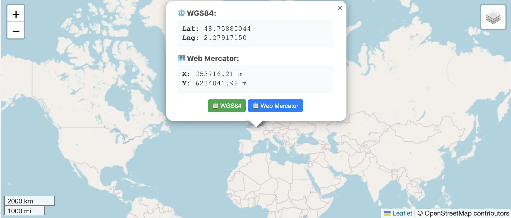
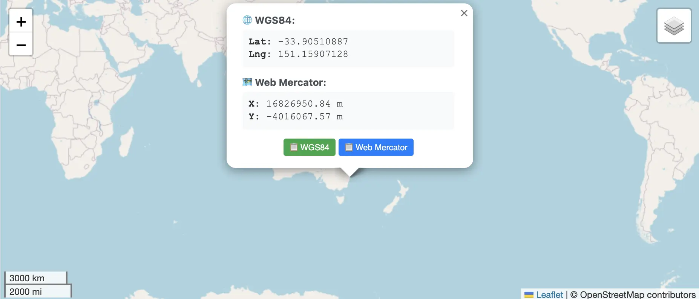

# [Jour 9 — Une distance en traîneau](https://coda-school.github.io/advent-2025/?day=09)
Aujourd'hui, les elfes ont enregistré le **trajet préparatoire du Père Noël**, mais les données sont **dans le désordre** et exprimées selon leur **système de coordonnées elfique**...

Il va fallloir qu'on écrive notre propre code pour **parser** (`order,x_m,y_m`), **trier**, **convertir** et **calculer** la distance entre le premier et le dernier point.

Je vais utiliser `kotlin` pour résoudre ce challenge.
Je commence par créer un nouveau projet `Kotlin` / `gradle` avec mon `IDE` favori.

```kotlin
import org.jetbrains.kotlin.gradle.dsl.JvmTarget

plugins {
    kotlin("jvm") version "1.9.21"
    application
}

repositories {
    mavenCentral()
}

dependencies {
    // Je vais utiliser Kotest pour les tests unitaires
    val kotestVersion = "5.8.0"
    testImplementation("io.kotest:kotest-runner-junit5:$kotestVersion")
    testImplementation("io.kotest:kotest-property-jvm:$kotestVersion")
    testImplementation(kotlin("test"))
}

tasks.test {
    useJUnitPlatform()
}

kotlin {
    jvmToolchain(21)

    compilerOptions {
        jvmTarget.set(JvmTarget.JVM_21)
    }
}
```

## Étape 1 : parser et trier les données
On commence par ajouter le fichier `trace` dans le dossier `resources` de notre projet.


- On peut désormais lire le fichier depuis les tests.

```kotlin
class TraceTests : StringSpec({
    "calculate the distance between the first and last point" {
        parseLines("trace")
            .shouldHaveSize(500);
    }
})

private fun parseLines(name: String): List<String> =
    getResource(name)
        .let {
            Files.readString(
                Path.of(Objects.requireNonNull(it).toURI())
            )
            // On split les lignes avec le bon séparateur
            .split("\r\n")
        }

private fun getResource(name: String): URL = TraceTests::class.java.classLoader.getResource(name)!!
```

- On va représenter chaque ligne de manière plus structurée avec une `data class` (`Immutable`)

```kotlin
data class TracePoint(val order: Int, val x: Double, val y: Double)
```

- On peut maintenant parser chaque ligne en `TracePoint` 

```kotlin
class TraceTests : StringSpec({
    "calculate the distance between the first and last point" {
        parseTracePoints("trace")
            .shouldHaveSize(500);
    }
})

...

// Fonction d'extension pour parser une ligne en TracePoint
private fun String.toTracePoint(): TracePoint =
    this.split(",")
        .run {
            TracePoint(
                this[0].toInt(),
                this[1].toDouble(),
                this[2].toDouble()
            )
        }

private fun parseTracePoints(fileName: String): List<TracePoint> =
    parseLines(fileName)
        .map { it.toTracePoint() }
        .sortedBy { it.order }
```

## Étape 2 : convertir les coordonnées
- On ajoute la fonction de conversion EPSG:3857 → WGS84 sur base des instructions fournies

```javascript
Soit `R = 6378137`
lon_deg = (x_m / R) * 180/π
lat_deg = (2 * atan(exp(y_m / R)) - π/2) * 180/π
```

- Ce qui donne en `kotlin` :

```kotlin
typealias Location = Pair<Double, Double>
private const val R_MERCATOR = 6_378_137.0

data class TracePoint(val order: Int, val x: Double, val y: Double) {
    fun toWgs84(): Location {
        val latitude = (2.0 * atan(exp(this.y / R_MERCATOR)) - Math.PI / 2.0) * 180.0 / Math.PI
        val longitude = (this.x / R_MERCATOR) * 180.0 / Math.PI

        return latitude to longitude
    }
}
```

## Étape 3 : calculer la distance géodésique
- On ajoute la fonction de calcul de distance géodésique (Haversine) sur base des instructions fournies

```javascript
Avec lat1, lon1, lat2, lon2 en radians :

dlat = lat2 - lat1
dlon = lon2 - lon1
a = sin²(dlat/2) + cos(lat1) - cos(lat2) - sin²(dlon/2)
c = 2 - atan2(sqrt(a), sqrt(1-a))
distance_km = 6371.0 - c
```

- Ce qui donne en `kotlin` :

```kotlin
private const val EARTH_RADIUS_KM = 6371.0

private fun haversineDistance(from: Location, to: Location): Double {
    fun degreesToRadians(degrees: Double): Double = degrees * Math.PI / 180.0

    val (lat1, lon1) = from.let { degreesToRadians(it.first) to degreesToRadians(it.second) }
    val (lat2, lon2) = to.let { degreesToRadians(it.first) to degreesToRadians(it.second) }

    val deltaLat = lat2 - lat1
    val deltaLon = lon2 - lon1

    val a = sin(deltaLat / 2).pow(2) + cos(lat1) * cos(lat2) * sin(deltaLon / 2).pow(2)
    val c = 2 * atan2(sqrt(a), sqrt(1 - a))

    return EARTH_RADIUS_KM * c
}
```

- On met tout ensemble dans notre test

```kotlin
class TraceTests : StringSpec({
    "calculate the distance between the first and last point" {
        parseTracePoints("trace")
            .let { points ->
                points.first().haversineDistanceTo(points.last())
            }
            .shouldBe(16968.724 plusOrMinus 0.001);
    }
})

data class TracePoint(val order: Int, val x: Double, val y: Double) {
    fun haversineDistanceTo(other: TracePoint): Double =
        haversineDistance(this.toWgs84(), other.toWgs84())

    private fun toWgs84(): Location {
        val latitude = (2.0 * atan(exp(this.y / R_MERCATOR)) - Math.PI / 2.0) * 180.0 / Math.PI
        val longitude = (this.x / R_MERCATOR) * 180.0 / Math.PI

        return latitude to longitude
    }
}
...
```

Voici le résultat que je trouve à communiquer aux elfes : `16 968.724 km`.
C'est la distance entre ces deux points en WGS84 :

|                 | Plan elfique                            | WGS 84                     |
|-----------------|-----------------------------------------|----------------------------|
| Point de départ | 253716.21038051567, 6234041.976798748   | 48.75885044, 2.27917150    |
| Point d'arrivée | 1.682695084323861E7, -4016067.571985976 | -33.90510887, 151.15900718 |

Voici une visualisation de ces points sur une carte :




J'espère que le Père Noël appréciera son trajet !