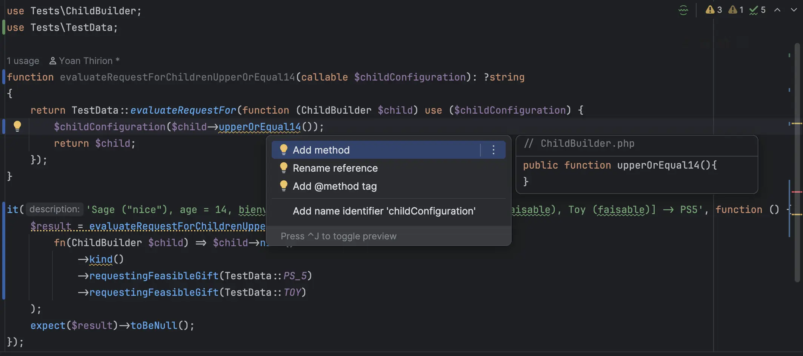
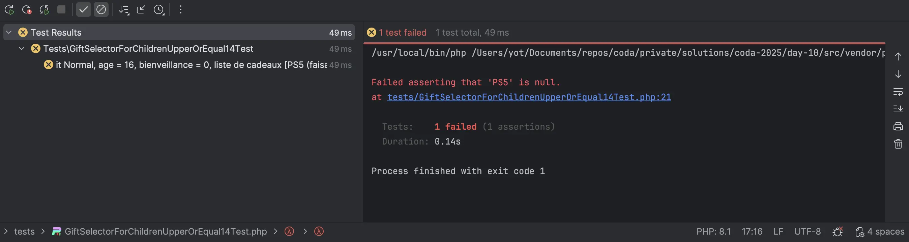
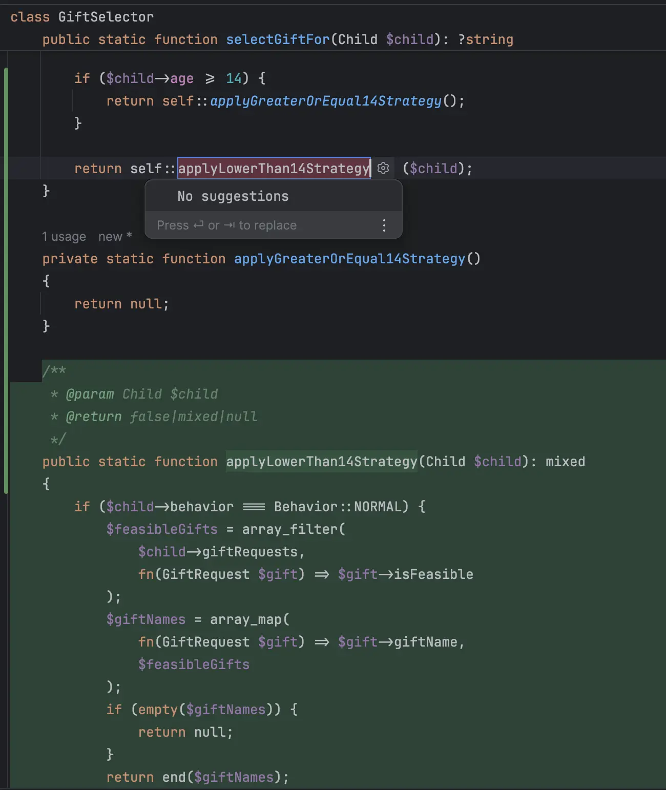
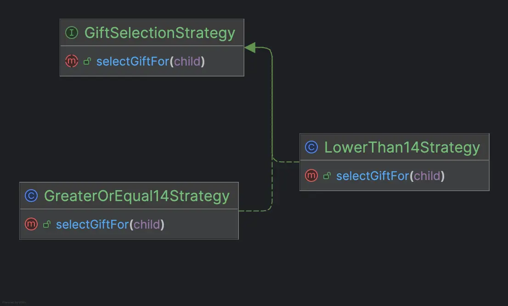

# [Jour 10 – La quête du cadeau parfait](https://coda-school.github.io/advent-2025/?day=10)
Les **elfes** veulent faire évoluer l'algorithme pour le rendre plus **personnalisé** et **créatif**.

On doit donc faire évoluer l'algorithme de sélection des cadeaux pour qu'il prenne en compte **deux stratégies différentes** :

`Enfants de moins de 14 ans` :
- **Sage ("nice")** : sélectionne le **premier** cadeau **faisable**
- **Normal** : sélectionne le **dernier** cadeau **faisable**
- **Mauvais ("naughty")** : retourne toujours **"Rien"**

`Enfants de 14 ans ou plus` :
- **Sage ("nice")** : si **bienveillance > 0.5**, sélectionne le **premier** cadeau **faisable**. Sinon, retourne **"Rien"**.
- **Normal** : si **bienveillance > 0.5**, sélectionne le **dernier** cadeau **faisable** (ordre inversé). Sinon, retourne **"Rien"**.
- **Mauvais ("naughty")** : retourne toujours **"Rien"**.

C'est parti en `php` pour aujourd'hui !

## Étape 1 : établir une liste de tests
Je vais piloter l'implémentation de ces nouvelles règles via des tests unitaires.

On commence alors par établir une liste de tests à partir des règles fournies par les elfes :

```text
`Enfants de 14 ans ou plus` :
Sage ("nice"), age = 14, bienveillance = 0.51, liste de cadeaux [PS5 (faisable), Toy (faisable)] -> PS5
Sage ("nice"), age = 15, bienveillance = 1, liste de cadeaux [A (infaisable), B (infaisable)] -> Rien
Sage ("nice"), age = 14, bienveillance = 0.49, liste de cadeaux [PS5 (faisable), Toy (faisable)] -> Rien
Sage ("nice"), age = 20, bienveillance = 1, liste de cadeaux [] -> Rien

Normal, age = 14, bienveillance = 0.8, liste de cadeaux [PS5 (faisable), Toy (faisable)] -> Toy
Normal, age = 18, bienveillance = 0.8, liste de cadeaux [PS5 (faisable), Car (infaisable)] -> PS5
Normal, age = 16, bienveillance = 0, liste de cadeaux [PS5 (faisable), Toy (faisable)] -> Rien

// Même chose que pour les enfants de moins de 14 ans
Mauvais ("naughty") -> Rien
```

## Étape 2 : ajouter un premier test
Il y a déjà des tests validant le comportement actuel de l'algorithme de sélection des cadeaux dans le fichier `GiftSelectorTest.php`.
- Je le renomme en `GiftSelectorForChildrenUnder14Test`
  - pour indiquer qu'il s'agit du comportement pour les enfants de moins de 14 ans
- Je prépare le terrain pour le premier test en refactorant les tests existants :

```php
// Forcer le fait qu'un enfant soit âgé de moins de 14 ans
function evaluateRequestForChildrenUnder14(callable $childConfiguration): ?string
{
    return TestData::evaluateRequestFor(function (ChildBuilder $child) use ($childConfiguration) {
        $childConfiguration($child->under14());
        return $child;
    });
}

it('selects first feasible gift for nice child', function () {
    $result = evaluateRequestForChildrenUnder14(fn(ChildBuilder $child) => $child->normal()
        ->requestingFeasibleGift(TestData::PS_5)
        ->requestingFeasibleGift(TestData::BOOK)
    );
    expect($result)->toBe('');
});

// Dans la classe ChildBuilder
public function under14(): self
{
    $this->age = 10;
    return $this;
}
```

- On va aller plus loin sur la configuration de la fonction `under14()`
  - On peut utiliser la librairie [`Faker`](https://fakerphp.org/) pour générer un âge aléatoire entre 0 et 13 ans

```php
public function under14(): self
{
    $this->age = $this->faker->numberBetween(0, 13);
    return $this;
}
```

Maintenant, on peut ajouter notre premier test pour les enfants de 14 ans ou plus :
- J'ajoute un fichier `GiftSelectorForChildrenUpperOrEqual14Test`

🔴 Je détaille une première attente (qui va échouer) :

```php
function evaluateRequestForChildrenUpperOrEqual14(callable $childConfiguration): ?string
{
    return TestData::evaluateRequestFor(function (ChildBuilder $child) use ($childConfiguration) {
        $childConfiguration($child->upperOrEqual14());
        return $child;
    });
}

it('Normal, age = 16, bienveillance = 0, liste de cadeaux [PS5 (faisable), Toy (faisable)] -> Rien', function () {
    $result = evaluateRequestForChildrenUpperOrEqual14(
        fn(ChildBuilder $child) => $child->normal()
            ->kind()
            ->requestingFeasibleGift(TestData::PS_5)
            ->requestingFeasibleGift(TestData::TOY)
    );
    expect($result)->toBeNull();
});
```

- On ajoute la méthode `upperOrEqual14()` dans la classe `ChildBuilder`
  - On génère la méthode à partir de notre `IDE`



```php
public function upperOrEqual14(): self
{
    $this->age = $this->faker->numberBetween(14, 21);
    return $this;
}
```

- On y ajoute également la méthode `notKind()`

```php
public function notKind()
{
    $this->kindness = $this->faker->randomFloat(2, 0.01, 0.5);
    return $this;
}
```

Notre test échoue désormais pour la "bonne raison" (pas parce qu'il manque du code) mais parce que l'attente n'est pas remplie :



🟢 Maintenant qu'on a tout ce qu'il faut, on va le faire passer au vert en implémentant la logique dans la classe `GiftSelector`.
- On commence par utiliser la kindness dans la classe `Child`

```php
class Child
{
    public function __construct(
        public readonly string   $firstName,
        public readonly string   $lastName,
        public readonly int      $age,
        public readonly Behavior $behavior,
        public readonly float $kindness,
        public readonly array    $giftRequests = []
    )
    {
    }
}
```

- On change l'algorithme pour le faire passer au vert le plus rapidement possible

```php
class GiftSelector
{
    public static function selectGiftFor(Child $child): ?string
    {
        if ($child->behavior === Behavior::NAUGHTY) {
            return null;
        }

        if ($child->age >= 14)
            return null;
        ...
    }
}
```

🔵 On peut refactorer ce code en séparant la logique (stratégie 🤔) de sélection fonction de l'âge.
- J'utilise les outils de refactoring de mon `IDE` (extract method) pour extraire la logique dans une nouvelle méthode :



```php
class GiftSelector
{
    public static function selectGiftFor(Child $child): ?string
    {
        // Même logique peu importe la stratégie
        if ($child->behavior === Behavior::NAUGHTY) {
            return null;
        }
        if ($child->age >= 14) {
            return self::selectGiftForChildrenUpperOrEqual14();
        }
        return self::selectfGiftForChildrenLowerThan14($child);
    }

    private static function selectGiftForChildrenUpperOrEqual14(Child $child): ?string
    {
        return null;
    }

    private static function selectfGiftForChildrenLowerThan14(Child $child): ?string
    {
        ...
    }
}
```

### Étape 3 : itérer sur les tests restants
On peut maintenant itérer sur les tests restants en les ajoutant un par un et en faisant passer chacun d'eux au vert.

```text
Sage ("nice"), age = 14, bienveillance = 0.51, liste de cadeaux [PS5 (faisable), Toy (faisable)] -> PS5
Sage ("nice"), age = 15, bienveillance = 1, liste de cadeaux [A (infaisable), B (infaisable)] -> Rien
Sage ("nice"), age = 14, bienveillance = 0.49, liste de cadeaux [PS5 (faisable), Toy (faisable)] -> Rien
Sage ("nice"), age = 20, bienveillance = 1, liste de cadeaux [] -> Rien

Normal, age = 14, bienveillance = 0.8, liste de cadeaux [PS5 (faisable), Toy (faisable)] -> Toy
Normal, age = 18, bienveillance = 0.8, liste de cadeaux [PS5 (faisable), Car (infaisable)] -> PS5
✅ Normal, age = 16, bienveillance = 0, liste de cadeaux [PS5 (faisable), Toy (faisable)] -> Rien

// Même chose que pour les enfants de moins de 14 ans
Mauvais ("naughty") -> Rien
```

🔴 On ajoute un nouveau cas de test :

```php
it('Normal, age = 14, bienveillance = 0.8, liste de cadeaux [PS5 (faisable), Toy (faisable)] -> Toy', function () {
    $result = evaluateRequestForChildrenUpperOrEqual14(
        fn(ChildBuilder $child) => $child->normal()
            ->kind()
            ->requestingFeasibleGift(TestData::PS_5)
            ->requestingFeasibleGift(TestData::TOY)
    );
    expect($result)->toBe(TestData::TOY);
});
```

🟢 On ajoute le minimum pour faire passer le test au vert :

```php
private static function selectGiftForChildrenUpperOrEqual14(Child $child): ?string
{
    if ($child->behavior === Behavior::NORMAL) {
        return "Toy";
    }
    return null;
}
```

🔵 On refactor en supprimant les valeurs hardcodées et en implémentant la logique complète :

```php
private static function selectGiftForChildrenUpperOrEqual14(Child $child): ?string
{
    if (!$child->isKind()) {
        return null;
    }

    $feasibleGifts = array_filter($child->giftRequests, fn(GiftRequest $gift) => $gift->isFeasible);

    return empty($feasibleGifts)
        ? null
        : end($feasibleGifts)->giftName;
}
```

Après plusieurs itérations, on obtient le code suivant :

```php
private static function selectGiftForChildrenUpperOrEqual14(Child $child): ?string
{
    if (!$child->isKind()) {
        return null;
    }

    $feasibleGifts = array_filter($child->giftRequests, fn(GiftRequest $gift) => $gift->isFeasible);

    if (empty($feasibleGifts)) {
        return null;
    }

    return $child->behavior === Behavior::NORMAL
        ? end($feasibleGifts)->giftName
        : reset($feasibleGifts)->giftName;
}
```

🔵 Il y a de la duplication entre les deux fonctions de sélection.

```php
// le filtrage des giftRequests est répété
$feasibleGifts = array_filter($child->giftRequests, fn(GiftRequest $gift) => $gift->isFeasible);
```

On peut extraire cette logique dans une méthode dédiée via notre `IDE` :
[](img/extract-move.mp4)

Voici à quoi ressemble le code à ce moment-là :

```php
class GiftSelector
{
    public static function selectGiftFor(Child $child): ?string
    {
        if ($child->behavior === Behavior::NAUGHTY) {
            return null;
        }
        if ($child->age >= 14) {
            return self::selectGiftForChildrenUpperOrEqual14($child);
        }
        return self::selectGiftForChildrenLowerThan14($child);
    }

    private static function selectGiftForChildrenUpperOrEqual14(Child $child): ?string
    {
        if (!$child->isKind()) {
            return null;
        }

        $feasibleGifts = $child->feasibleGifts();
        if (empty($feasibleGifts)) {
            return null;
        }

        return $child->behavior === Behavior::NORMAL
            ? end($feasibleGifts)->giftName
            : reset($feasibleGifts)->giftName;
    }

    private static function selectGiftForChildrenLowerThan14(Child $child): ?string
    {
        $feasibleGifts = $child->feasibleGifts();

        if (empty($feasibleGifts)) {
            return null;
        }

        return $child->behavior === Behavior::NORMAL
            ? end($feasibleGifts)->giftName
            : reset($feasibleGifts)->giftName;
    }
}
```

## Étape 4 : extraire les stratégies
On peut aller plus loin en extrayant les stratégies de sélection dans des classes dédiées en appliquant le pattern [`Strategy`](https://refactoring.guru/design-patterns/strategy).

```php
class GiftSelector
{
    public static function selectGiftFor(Child $child): ?string
    {
        return !$child->isNaughty()
            ? self::strategyFor($child)->selectGiftFor($child)
            : null;
    }
    
    // Factory Method à étendre si besoin d'ajouter une nouvelle stratégie
    private static function strategyFor(Child $child): GiftSelectionStrategy
    {
        return $child->age >= 14
            ? new GreaterOrEqual14Strategy()
            : new LowerThan14Strategy();
    }
}

abstract class GiftSelectionStrategy
{
    abstract public function selectGiftFor(Child $child): ?string;

    protected function selectFeasibleGiftFor(Child $child): ?string
    {
        $feasibleGifts = $child->feasibleGifts();
        return !empty($feasibleGifts)
            ? $this->selectGift($child, $feasibleGifts)
            : null;
    }

    private function selectGift(Child $child, array $feasibleGifts)
    {
        return $child->hasNormalBehavior()
            ? end($feasibleGifts)->giftName
            : reset($feasibleGifts)->giftName;
    }
}

class LowerThan14Strategy extends GiftSelectionStrategy
{
    public function selectGiftFor(Child $child): ?string
    {
        return $this->selectFeasibleGiftFor($child);
    }
}

class GreaterOrEqual14Strategy extends GiftSelectionStrategy
{
    public function selectGiftFor(Child $child): ?string
    {
        return $child->isKind()
            ? $this->selectFeasibleGiftFor($child)
            : null;
    }
}
```

Voici le diagramme de classes :



En utilisant ce Design Pattern, on isole les différentes stratégies de sélection de cadeaux en fonction de l'âge de l'enfant.

Si demain les elfes veulent ajouter une nouvelle stratégie, il leur suffira de créer une nouvelle classe implémentant `GiftSelectionStrategy` et de modifier la `Factory Method`.