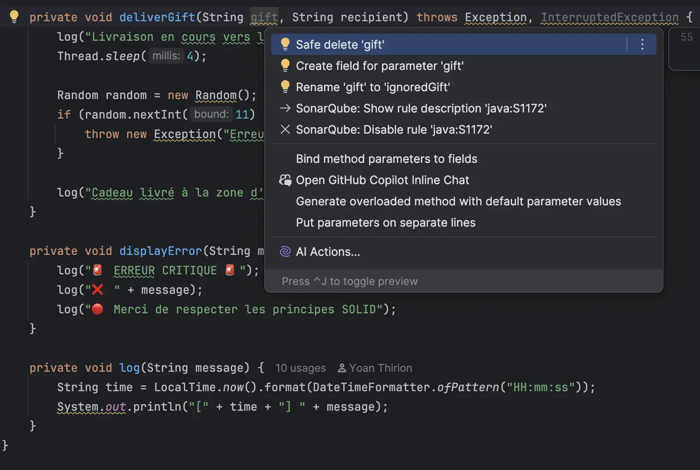
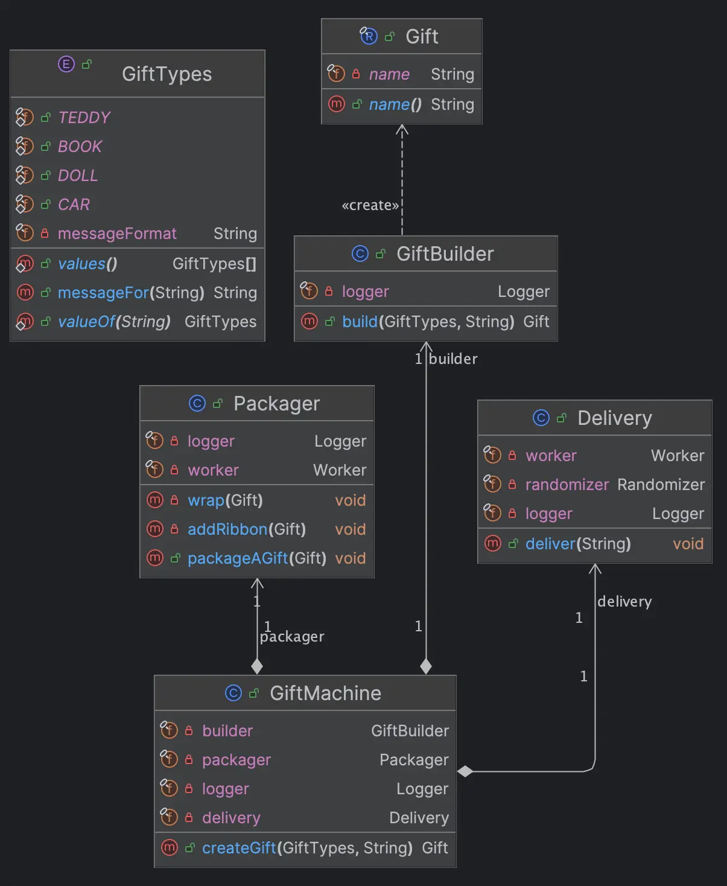

# [Jour 12 - Elfe-ervescence](https://coda-school.github.io/advent-2025/?day=12)
Aujourd'hui le challenge tourne autour de l'application des principes `S.O.L.I.D.` dans le code elfique.

Cela fait un moment que je n'ai pas utilisé de `java`, c'est parti !

## Étape 1 - identifier les violations des principes SOLID
On commence par analyser le code fourni dans le fichier `GiftMachine.java` (Code smells et violation des principes SOLID) :

```java
// 🚫SRP : cette classe a trop de responsabilité (création, emballage, livraison, journalisation, ...)
public class GiftMachine {
    // Logique d'orchestration ici
    // Sa signature est vraiment pas terrible... (String, String) -> String
    // On n'utilise que des types primitifs (String) et on ne représente pas le fait que la création peit échouer
    public String createGift(String type, String recipient) {
        try {
            log("Démarrage de la création du cadeau pour " + recipient);

            // Utiliser un type Gift pour représenter le business
            String gift = buildGift(type, recipient);

            // Avoir une étape d'emballage plus cohésive
            wrapGift(gift);
            addRibbon(gift);

            deliverGift(gift, recipient);

            log("Cadeau prêt pour " + recipient + " : " + gift);

            return gift;
        }
        // catch toutes les exceptions possibles sans les filtrer...
        // Quid du traitement de l'exception
        catch (Exception e) {
            // Pourquoi logger dans la console ?
            displayError(e.getMessage());
            // Rendre transparent à l'appelant que la création a échoué
            // Plutôt que de le forcer à parser ce retour
            return "Échec de la création du cadeau pour " + recipient;
        }
    }

    // 🚫OCP : utilisation d'un switch-case
    // Chaque nouveau type de cadeau nécessite une modification de cette méthode -> pas ouvert aux extensions...
    private String buildGift(String type, String recipient) throws Exception {
        log("Construction du cadeau de type '" + type + "'...");

        switch (type) {
            case "teddy":
                return "🧸 Ourson en peluche pour " + recipient;
            case "car":
                return "🚗 Petite voiture pour " + recipient;
            case "doll":
                return "🪆 Poupée magique pour " + recipient;
            case "book":
                return "📚 Livre enchanté pour " + recipient;
            default:
                // Pourquoi gérer ce cas d'erreur via Exception alors que c'est un ca qu'on peut gérer assez facilement
                // Encore pire on n'utilise pas de type spécifique pour représenter cette erreur...
                throw new Exception("Type de cadeau '" + type + "' non reconnu !");
        }
    }

    // Isoler ces logiques dans des classes dédiées : Emballage, Livraison...
    private void wrapGift(String gift) throws InterruptedException {
        log("Emballage du cadeau : " + gift);
        Thread.sleep(3);
    }

    private void addRibbon(String gift) throws InterruptedException {
        log("Ajout du ruban magique sur : " + gift);
        Thread.sleep(2);
    }

    // Paramètre inutile : 'gift'
    // Pourquoi utiliser le type `Exception` qui est très générique
    private void deliverGift(String gift, String recipient) throws Exception, InterruptedException {
        log("Livraison en cours vers l'atelier de distribution...");
        Thread.sleep(4);

        // 🚫DIP : les dépendances sont déclarées en dur (instanciées à la main) : Random, Thread.sleep, System.out, ...
        // Cela rend le code non testable et non flexible
        Random random = new Random();
        if (random.nextInt(11) > 8) { // 1 chance sur 5 environ
            throw new Exception("Erreur de livraison : le traîneau est tombé en panne.");
        }

        log("Cadeau livré à la zone d’expédition pour " + recipient);
    }

    private void displayError(String message) {
        log("🚨 ERREUR CRITIQUE 🚨");
        log("❌ " + message);
        log("🔴 Merci de respecter les principes SOLID");
    }

    private void log(String message) {
        String time = LocalTime.now().format(DateTimeFormatter.ofPattern("HH:mm:ss"));
        System.out.println("[" + time + "] " + message);
    }

    public static void main(String[] args) {
        GiftMachine machine = new GiftMachine();
        String result = machine.createGift("teddy", "Alice");
        System.out.println(result);
    }
}
```

## Étape 2 - identifier les refactorings
Voici quelques idées dans le désordre des refactorings possibles pour améliorer ce code :
- [ ] Introduire 1 type `Gift` pour représenter les cadeaux
- [ ] Avoir 1 concept de type de `Gift`
- [ ] Isoler la création de cadeau dans 1 `Factory` dédiée
- [ ] Isoler l'emballage dans 1 classe dédiée
- [ ] Isoler la livraison dans 1 classe dédiée
- [ ] Introduire 1 système de `Logger` abstrait qu'on pourra injecter
  - Aujourd'hui on loggue dans la console, demain on pourrait vouloir logger dans un fichier ou un système de monitoring
- [ ] Rendre les dépendances injectables (ex: `Random`)
- [ ] Rendre transparent que le traitement peut échouer (`Exception`, `Monad`, ...)

## Étape 3 - refactorer le code
On peut maintenant se lancer dans le refactoring du code en appliquant les changements identifiés :
Comme pour les jours précédents, je vais utiliser les fonctionnalités de refactoring de mon IDE (`IntelliJ IDEA`) pour m'aider dans cette tâche.

- Je commence par un refactoring de surface afin de nettoyer le code :


- J'applique la technique [Sprout](https://understandlegacycode.com/blog/key-points-of-working-effectively-with-legacy-code/#1-the-sprout-technique) :
  - Ecrire le code à côté et l'intégrer une fois que je suis confiant
  - Je commence avec le `GiftBuilder`

```java
// On isole la logique de logging dans une interface
public interface Logger {
    void log(String message);
}

public class GiftBuilder {
    private final Logger logger;

    // On injecte le logger via le constructeur
    public GiftBuilder(Logger logger) {
        this.logger = logger;
    }

    public String build(String type, String recipient) throws Exception {
        logger.log("Construction du cadeau de type '" + type + "'...");

        return switch (type) {
            case "teddy" -> "🧸 Ourson en peluche pour " + recipient;
            case "car" -> "🚗 Petite voiture pour " + recipient;
            case "doll" -> "🪆 Poupée magique pour " + recipient;
            case "book" -> "📚 Livre enchanté pour " + recipient;
            default -> throw new Exception("Type de cadeau '" + type + "' non reconnu !");
        };
    }
}
```

- J'introduis une `enum` pour représenter les types de cadeaux :

```java
public enum GiftTypes {
    TEDDY("🧸 Ourson en peluche pour %s"),
    CAR("🚗 Petite voiture pour %s"),
    DOLL("🪆 Poupée magique pour %s"),
    BOOK("📚 Livre enchanté pour %s");

    private final String messageFormat;

    GiftTypes(String messageFormat) {
        this.messageFormat = messageFormat;
    }

    public String messageFor(String recipient) {
        return String.format(messageFormat, recipient);
    }
}
```

Cela permet de simplifier le `GiftBuilder` et de respecter le principe `OCP` (`Open/Closed Principle`) : 
- Ajouter un nouveau type de cadeau ne nécessite pas de modifier le code existant, mais simplement d'ajouter une nouvelle valeur à l'`enum`
- En bonus, ce n'est plus nécessaire de lancer une exception pour un type inconnu en contraignant l'input via `GiftTypes`

```java
public class GiftBuilder {
    private final Logger logger;

    public GiftBuilder(Logger logger) {
        this.logger = logger;
    }

    public Gift build(GiftTypes type, String recipient) {
        logger.log("Construction du cadeau de type '" + type + "'...");
        return new Gift(type.messageFor(recipient));
    }
}

public record Gift(String name) {
}
```

On continue avec l'emballage :

```java
public class Packager {
    private final Logger logger;

    public Packager(Logger logger) {
        this.logger = logger;
    }

    public void packageAGift(Gift gift) throws InterruptedException {
        wrap(gift);
        addRibbon(gift);
    }

    private void wrap(Gift gift) throws InterruptedException {
        logger.log("Emballage du cadeau : " + gift.name());
        Thread.sleep(3);
    }

    public void addRibbon(Gift gift) throws InterruptedException {
        logger.log("Ajout du ruban magique sur : " + gift.name());
        Thread.sleep(2);
    }
}
```

On isole la dépendance sur `Thread.sleep` :

```java
public interface Worker {
    void run(int time);
}

public class ThreadWorker implements Worker {
    @Override
    public void run(int time) {
        try {
            Thread.sleep(time);
        } catch (InterruptedException e) {
            Thread.currentThread().interrupt();
        }
    }
}
```

On continue avec la livraison :

```java
public class Delivery {
    private final Worker worker;
    private final Randomizer randomizer;
    private final Logger logger;

    public Delivery(Worker worker,
                    Randomizer randomizer,
                    Logger logger) {
        this.worker = worker;
        this.randomizer = randomizer;
        this.logger = logger;
    }

    public void deliver(String recipient) throws Exception {
        logger.log("Livraison en cours vers l'atelier de distribution...");
        worker.run(4);

        if (randomizer.randomInt() > 8) { // 1 chance sur 5 environ
            throw new Exception("Erreur de livraison : le traîneau est tombé en panne.");
        }
        logger.log("Cadeau livré à la zone d’expédition pour " + recipient);
    }
}

public class Randomizer {
    private final Random random = new Random();

    public int randomInt() {
        return random.nextInt(11);
    }
}
```

Enfin, on refactorise la `GiftMachine` pour utiliser ces nouvelles classes :

```java
public String createGift(GiftTypes type, String recipient) {
    var logger = new Console();
    try {
        logger.log("Démarrage de la création du cadeau pour " + recipient);

        var worker = new ThreadWorker();
        var randomizer = new Randomizer();
        var gift = new GiftBuilder(logger)
                .build(type, recipient);

        var packager = new Packager(worker, logger);
        packager.packageAGift(gift);

        var delivery = new Delivery(worker, randomizer, logger);
        delivery.deliver(recipient);

        logger.log("Cadeau prêt pour " + recipient + " : " + gift.name());

        return gift.name();
    } catch (DeliveryIssueException e) {
        logger.error(e);
        return "Échec de la création du cadeau pour " + recipient;
    }
}
```

On va maintenant inverser la dépendance entre `GiftMachine` et les autres classes en injectant les dépendances via le constructeur :

```java
public class GiftMachine {
    private final GiftBuilder builder;
    private final Packager packager;
    private final Delivery delivery;
    private final Logger logger;

    public GiftMachine(GiftBuilder builder,
                       Packager packager,
                       Delivery delivery,
                       Logger logger) {
        this.builder = builder;
        this.packager = packager;
        this.delivery = delivery;
        this.logger = logger;
    }

    // La méthode createGift retourne désormais un Gift
    // On a spécifier la seule Exception métier qui pourrait survenir
    public Gift createGift(GiftTypes type, String recipient) throws DeliveryIssueException {
        logger.log("Démarrage de la création du cadeau pour " + recipient);

        var gift = builder.build(type, recipient);
        packager.packageAGift(gift);
        delivery.deliver(recipient);

        logger.log("Cadeau prêt pour " + recipient + " : " + gift.name());

        return gift;
    }
}

// Le Main ressemble désormais à :
public class Main {
    public static void main(String[] args) {
        var logger = new Console();
        var worker = new ThreadWorker();
        var randomizer = new Randomizer();

        GiftMachine machine = new GiftMachine(
                new GiftBuilder(logger),
                new Packager(worker, logger),
                new Delivery(worker, randomizer, logger),
                logger
        );

        createGiftFor(machine, TEDDY, "Alice", logger);
        createGiftFor(machine, BOOK, "Bob", logger);
    }

    private static void createGiftFor(GiftMachine machine,
                                      GiftTypes type,
                                      String recipient,
                                      Logger logger) {
        try {
            var gift = machine.createGift(type, recipient);
            logger.log("🎁 Résultat final : " + gift.name());
            logger.log("-----------------------------------");
        } catch (DeliveryIssueException e) {
            logger.error(e);
        }
    }
}
```

À la fin voici les classes permettant de supporter la création de cadeaux respectant au mieux les principes `S.O.L.I.D.` :
La classe `GiftMachine` est maintenant responsable uniquement de l'orchestration des différentes étapes de création d'un cadeau.

