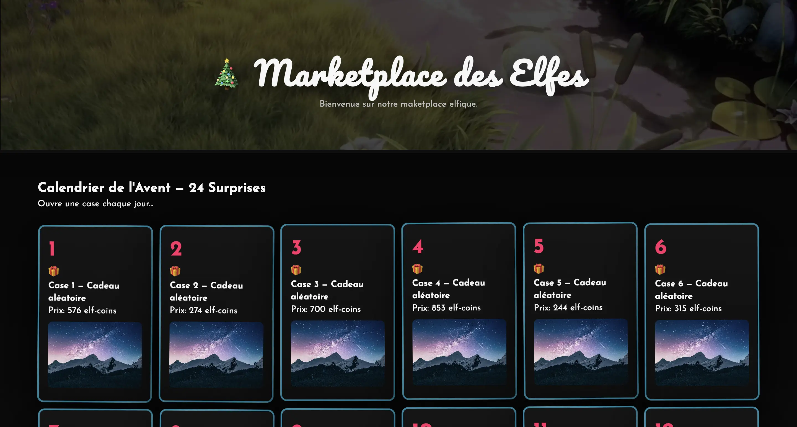
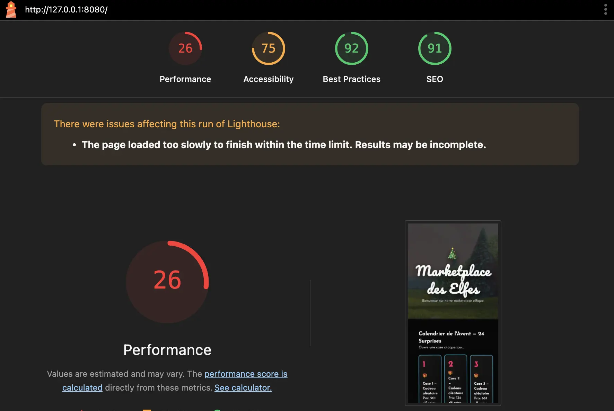
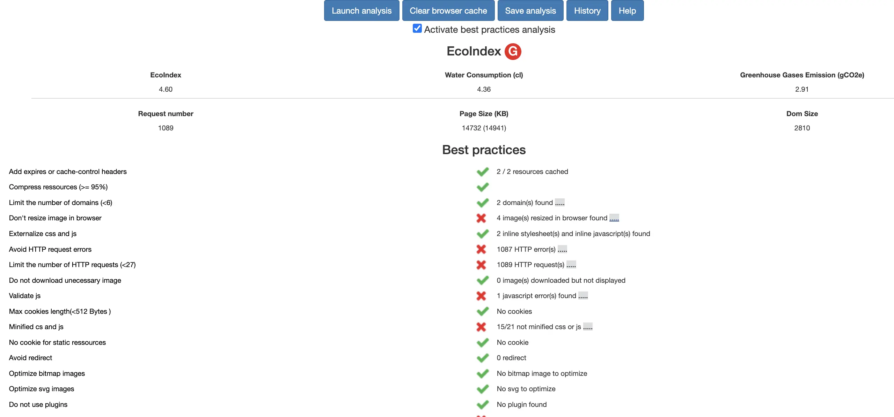

# [Jour 13 — La marketplace des Elfes](https://coda-school.github.io/advent-2025/?day=13)
Aujourd'hui, les elfes font appel à nos connaissances en `Numérique responsable` afin d'auditer leur Marketplace !

## Étape 1 : auditer le site
On va utiliser [Lighthouse](https://chromewebstore.google.com/detail/lighthouse/blipmdconlkpinefehnmjammfjpmpbjk?hl=fr) et [GreenIT-Analysis](https://www.greenit.fr/2019/07/02/web-evaluez-lempreinte-dune-page-en-un-clic/) (empreinte environnementale).

On commence par lancer le site localement :

```bash
npx http-server -p 8080
```

Visuellement, on voit rapidement qu'il va y avoir du travail à faire :


### Lighthouse
Je vais le lancer en [`CLI`](https://github.com/GoogleChrome/lighthouse?tab=readme-ov-file#using-the-node-cli) :

```shell
npm install -g lighthouse
lighthouse http://127.0.0.1:8080/
```

Le rapport est disponible [ici](report/lighthouse.html).

Les scores sont très faibles, notamment en `Performance` (26%) et `Accessibility` (75%).


### Analyse GreenIT
L'eco-index est carrément catastrophiqe: `G` avec une consommation démentielle dénergie et d'eau.
Plus on laisse le site ouvert plus le score se dégrade...



## Étape 2 : évaluer le site
- Note synthèse : **🟥 Rouge**
  - Le site charge de très **nombreuses librairies lourdes et redondantes** (React, Vue, jQuery en double, Three.js, Chart.js, Moment, Lodash, SDK FB/Twitter/GA…)
  - Plus un **fond vidéo autoplay** et **des images 6K** non optimisées
  - Cela crée un **coût réseau et CPU très élevé**, surtout en 3G/terminaux modestes

```text
https://images.unsplash.com/photo-1519681393784-d120267933ba?q=100&w=4000&h=3000&fit=crop is resized from 4000x3000 to 169x120
https://images.unsplash.com/photo-1543353071-087092ec393a?q=100&w=6000&h=4000&fit=crop is resized from 6000x4000 to 264x220
https://images.unsplash.com/photo-1519681393784-d120267933ba?q=100&w=6000&h=4000&fit=crop is resized from 6000x4000 to 411x408
https://images.unsplash.com/photo-1511765224389-37f0e77cf0eb?q=100&w=6000&h=4000&fit=crop is resized from 6000x4000 to 411x408
```

- **Performance : `26%`**
  - Rendue lente par : images géantes, vidéo, 50 000 points de graphique, scènes 3D animées, polling permanent
- **Best Practices (estim.) :  92%**
  - Duplications de scripts
  - Multiples frameworks non utilisés dans le DOM
  - Polling agressif
- **Accessibility (estim.) : 75%** - à investiguer
- **GreenIT-Analysis (estim.) : empreinte très élevée `G`**
  - **Dizaines de Mo** potentiels (vidéo + 3× images ~6000 px + multiples bundles CDN)
  - **CPU/GPU en continu** (3D, chart massif, timers)
  - **polling** toutes les 1–3 s

## Étape 3 : identifier des actions concrètes

| # | Action concrète                                                                                                                                                                                                             | Impact      | Effort  | Pourquoi / où le faire                                                                                       |
| - | --------------------------------------------------------------------------------------------------------------------------------------------------------------------------------------------------------------------------- |-------------|---------| ------------------------------------------------------------------------------------------------------------ |
| 1 | **Supprimer les doublons & frameworks inutiles** (garder **zéro** framework ou un seul si nécessaire ; enlever jQuery x2, React, Vue, Lodash, Moment si non utilisés).                                                      | Très fort   | Faible  | Réduit le JS initial, la contention CPU/GPU et le nombre de requêtes. Voir `<script>` nombreux et doublons.  |
| 2 | **Optimiser les médias** : retirer la **vidéo autoplay**, ou la remplacer par une image **poster** (et “Play” opt-in) ; **downscale** les images Unsplash (ex. `w=800&q=60`) + `loading="lazy"` + attributs `width/height`. | Très fort   | Faible  | Le fond vidéo et les images 6K plombent LCP/poids.                                                           |
| 3 | **Désactiver les calculs lourds & réduire les points du chart** (≤ 500–1000 points) ; **stopper le bouton “tempête CPU”** en prod ; retirer les **tâches de fond** répétées.                                                | Très fort   | Faible  | Le CPU explose (boucles `expensiveComputation`, 50k points, setTimeouts).                                    |
| 4 | **Couper/Throttler le polling** (passer à **fetch on-demand** ou **toutes 60–120 s**, regrouper les endpoints) et **ne charger les SDK sociaux que sur consentement**.                                                      | Fort        | Faible  | Évite requêtes constantes et JS tiers coûteux.                                                               |

Le mieux sera de suivre les recommandations de `Green-IT Analysis` 😉.

## Exemples de corrections

### Nettoyage du `<head>`

```html
<!-- Supprimer: jQuery (x2), React, Vue, Lodash, Moment, Three.js, Chart.js si non utilisés réellement) -->
<link rel="stylesheet" href="styles.css">
<script defer src="script.js"></script> <!-- une seule fois -->
```

### Stopper calculs & polling agressifs

```js
// Supprimer ces appels en prod :
/* setInterval(..., 1000/2000/3000) */
const enableLiveFeeds = false; // activer au clic, pas au chargement

// Retirer "blast CPU" ou le masquer en prod
document.getElementById('blastCpu')?.remove();

// Éviter les expensiveComputation(...) au load et en répétition
```

Il va y avoir du boulot, mais le site sera bien plus rapide, plus vert, et plus agréable à utiliser !
Il ne reste plus qu'à communiquer ces recommandations aux elfes.