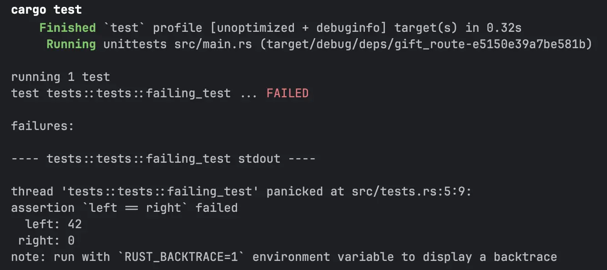
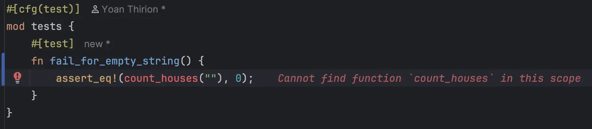
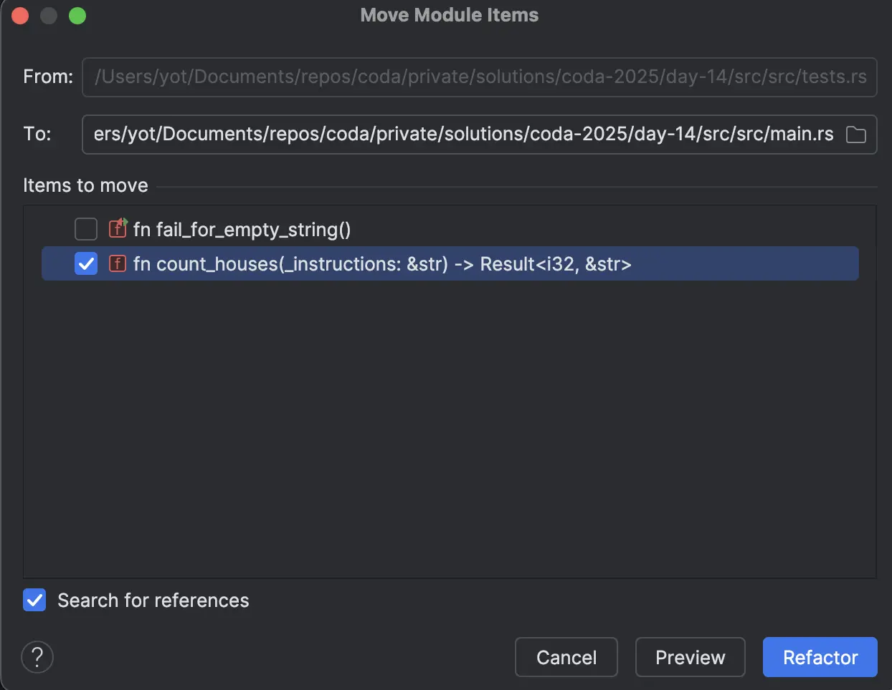

# [Jour 14 — Le chemin des cadeaux](https://coda-school.github.io/advent-2025/?day=14)
Aujourd'hui, on va aider Santa à calculer **le nombre de maisons distinctes** qui ont reçu au moins un cadeau, en suivant une série d’instructions de déplacement.
C'est donc un challenge d'algorithmique.

Je vais l'aborder avec **TDD (Test-Driven Development)** et je vais utiliser **Rust** (que je ne connais pas) pour l'implémentation.

## Étape 0 - setup de mon environnement Rust
Je vais suivre la [documentation officielle](https://rust-lang.org/fr/learn/get-started/) pour installer Rust :

```shell
curl --proto '=https' --tlsv1.2 -sSf https://sh.rustup.rs | sh
```

- Je crée un nouveau projet :
```shell
cargo new gift_route
cd gift_route
```

- Je valide que tout fonctionne :
```shell
cargo run
```

✅ Tout bon je peux maintenant ajouter un premier test qui échoue.

- Je crée un nouveau module `tests.rs` sur base de l’exemple donné [ici](https://doc.rust-lang.org/rust-by-example/testing/unit_testing.html) :

```rust
#[cfg(test)]
mod tests {
    #[test]
    fn failing_test() {
        assert_eq!(42, 0);
    }
}
```

Je valide que le test échoue bien et que la raison m'est bien indiquée :

```shell
cargo test
```

On est tout bon pour se lancer sur le challenge :



## Étape 1 - créer la liste de tests
Les elfes nous ont fourni quelques exemples simples.

```text
NNESESW -> 8 positions uniques
NNSS -> 3 positions uniques
```

Cela m'interroge sur les cas limites à couvrir également :
- Qu'est-ce qui se passe si la chaîne est vide ?
- Qu'est ce qui se passe si la chaîne contient des caractères invalides (différents de `N`, `S`, `E`, `W`) ?

J'ajoute cela à ma `test list` :

```text
Cas non passants / limites :
- "" -> Erreur ou 1 (position de départ) ?
- 0 -> Erreur car caractère invalide
- NEWNSX -> Erreur car caractère invalide

Cas passants :
NNESESW -> 8 positions uniques
NNSS -> 3 positions uniques
```

## Étape 2 - écrire un premier test
🔴 je commence par écrire un test pour le premier exemple (chaine vide)

En commençant par le cas le plus simple (chaine vide), cela me permet de poser les bases de l'implémentation et de décider comment représenter l'erreur (signature de la fonction) :



Je vais utiliser un [`Result<i32, &str>`](https://doc.rust-lang.org/std/result/) pour la fonction `count_houses` :

```rust
fn count_houses(_instructions: &str) -> Result<i32, &str> {
    Ok(0)
}
```

🟢 je le fais passer en implémentant le minimum pour passer le test

```rust
fn count_houses(_instructions: &str) -> Result<i32, &str> {
    Err("Merci de fournir des instructions")
}
```

🔵 je déplace le code dans `main.rs`



En implémentant l'ensemble des cas non passants mon code ressemble à cela :

```rust
#[cfg(test)]
mod tests {
    use crate::count_houses;
    use parameterized::parameterized;

    #[test]
    fn fail_for_empty_string() {
        assert_eq!(
            count_houses(""),
            Err("Merci de fournir des instructions")
        );
    }

    // Utilisation des tests paramétrés pour éviter la duplication de code : https://docs.rs/parameterized/latest/parameterized/
    #[parameterized(instructions = {"0","NEWNSX","0123456789", "\n"})]
    fn fail_for_invalid_characters(instructions: &str) {
        assert_eq!(
            count_houses(instructions),
            Err("Les instructions sont invalides")
        );
    }
}

pub fn count_houses(instructions: &str) -> Result<i32, &str> {
    if instructions.is_empty() {
        return Err("Merci de fournir des instructions");
    }
    Err("Les instructions sont invalides")
}
```

## Étape 3 - itérer avec les cas passants
On met à jour notre liste de tests :
```text
Cas non passants / limites :
✅ "" -> Erreur ou 1 (position de départ) ?
✅ 0 -> Erreur car caractère invalide
✅ NEWNSX -> Erreur car caractère invalide

Cas passants :
NNESESW -> 8 positions uniques
NNSS -> 3 positions uniques
```

🔴 on ajoute le cas "NNSS" -> 3

```rust
#[parameterized(instructions = { "NNSS" }, expected_result = { 3 })]
fn success_for_valid_instructions(instructions: &str, expected_result: i32) {
    assert_eq!(
        count_houses(instructions),
        Ok(expected_result)
    );
}
```

🟢 je le fais passer au vert le plus rapidement possible

```rust
pub fn count_houses(instructions: &str) -> Result<i32, &str> {
    if instructions == "NNSS" {
        return Ok(3);
    }

    if instructions.is_empty() {
        return Err("Merci de fournir des instructions");
    }
    Err("Les instructions sont invalides")
}
```

🔵 on est maintenant prêt pour refactorer

```rust
const ALLOWED_CHARS: [char; 4] = ['N', 'E', 'W', 'S'];

pub fn count_houses(instructions: &str) -> Result<i32, &str> {
    if instructions.is_empty() {
        return Err("Merci de fournir des instructions");
    } else if contains_invalid_character(instructions) {
        return Err("Les instructions sont invalides")
    }
    Ok(3)
}

fn contains_invalid_character(instructions: &str) -> bool {
    instructions
        .chars()
        .any(|c| !is_valid(c))
}

fn is_valid(c: char) -> bool {
    ALLOWED_CHARS.contains(&c)
}
```

🔴 on ajoute le cas "NNESESW" -> 8

```rust
#[parameterized(instructions = { "NNSS", "NNESESW" }, expected_result = { 3, 8 })]
fn success_for_valid_instructions(instructions: &str, expected_result: i32) {
    assert_eq!(
        count_houses(instructions),
        Ok(expected_result)
    );
}
```

🟢 je le fais passer au vert le plus rapidement possible

```rust
pub fn count_houses(instructions: &str) -> Result<i32, &str> {
    if instructions.is_empty() {
        return Err("Merci de fournir des instructions");
    } else if contains_invalid_character(instructions) {
        return Err("Les instructions sont invalides")
    }

    if instructions.len() > 4 {
        return Ok(8);
    }
    Ok(3)
}
```

🔵 on est maintenant prêt pour refactorer, en implémentant la logique de déplacement

Je vais ici utiliser : 
- un [`HashSet`](https://doc.rust-lang.org/rust-by-example/std/hash/hashset.html) pour stocker les positions uniques des maisons visitées
- retourner la taille du `HashSet` à la fin

```rust
pub fn count_houses(instructions: &str) -> Result<i32, &str> {
    // On utilise le Pattern Matching pour simplifier les conditions
    match (instructions.is_empty(), contains_invalid_character(instructions)) {
        (true, _) => Err("Merci de fournir des instructions"),
        (_, true) => Err("Les instructions sont invalides"),
        _ => Ok(count_houses_safely(instructions)),
    }
}

fn contains_invalid_character(instructions: &str) -> bool {
    instructions
        .chars()
        .any(|c| !is_valid(c))
}

fn is_valid(c: char) -> bool {
    ALLOWED_CHARS.contains(&c)
}

fn count_houses_safely(instructions: &str) -> i32 {
    let mut current_position: Coordinate = (0, 0);
    let mut houses: HashSet<Coordinate> = HashSet::new();

    houses.insert(current_position);

    instructions
        .chars()
        .for_each(|c| {
            current_position = move_to(current_position, c);
            houses.insert(current_position);
        });

    houses.len() as i32
}

type Coordinate = (i32, i32);

fn move_to((x, y): Coordinate, dir: char) -> Coordinate {
    match dir {
        'N' => (x, y + 1),
        'S' => (x, y - 1),
        'E' => (x + 1, y),
        'W' => (x - 1, y),
        _ => panic!("Invalid direction"),
    }
}
```

Je finis en extrayant les constantes :

```rust
const ALLOWED_CHARS: [char; 4] = ['N', 'E', 'W', 'S'];

const NORTH: char = 'N';
const SOUTH: char = 'S';
const EAST: char = 'E';
const WEST: char = 'W';

pub fn count_houses(instructions: &str) -> Result<i32, &str> {
    parse_instructions(instructions)
        .map(|instructions| count_houses_safely(instructions))
}

fn parse_instructions(instructions: &str) -> Result<&str, &str> {
    if instructions.is_empty() {
        return Err("Merci de fournir des instructions");
    } else if contains_invalid_character(instructions) {
        return Err("Les instructions sont invalides")
    }
    Ok(instructions)
}

fn contains_invalid_character(instructions: &str) -> bool {
    instructions
        .chars()
        .any(|c| !is_valid(c))
}

fn is_valid(c: char) -> bool {
    ALLOWED_CHARS.contains(&c)
}

fn count_houses_safely(instructions: &str) -> i32 {
    let mut current_position: Coordinate = (0, 0);
    let mut houses: HashSet<Coordinate> = HashSet::new();

    houses.insert(current_position);

    instructions
        .chars()
        .for_each(|c| {
            current_position = move_to(current_position, c);
            houses.insert(current_position);
        });

    houses.len() as i32
}

fn move_to((x, y): Coordinate, direction: char) -> Coordinate {
    match direction {
        NORTH => (x, y + 1),
        SOUTH => (x, y - 1),
        EAST => (x + 1, y),
        WEST => (x - 1, y),
        _ => panic!("Invalid direction"),
    }
}
```

## Étape 4 - exécuter sur les données réelles
Maintenant que je suis en confiance avec mon code, je peux l'exécuter sur les données réelles.

Je rajoute un nouveau test afin de calculer le nombre de maisons uniques pour le fichier `steps` :

```rust
#[test]
fn calculate_result_for_real_steps() {
    assert_eq!(
        count_houses(
            &get_content_as_string("rsc/steps")
        ), Ok(5260)
    );
}

fn get_content_as_string(path: &str) -> String {
    fs::read_to_string(path)
        .map_err(|_| "Erreur lors de la lecture du fichier")
        .map(|content| content.trim().to_string())
        .unwrap()
}
```

> La réponse est `5260` maisons uniques qui ont reçu au moins un cadeau cette année-là ! 🎅