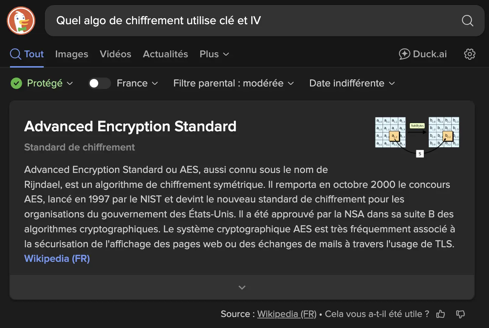

# [Jour 16 - Un message secret](https://coda-school.github.io/advent-2025/?day=16)
Aujourd'hui, on doit déchiffrer un message ultra-secret envoyé par le Père Noël.

## Les indices de l’équipe ElfSec
L'équipe `ElfSec` ont documenté le nécessaire pour décrypter les emails à l'intérieur de cette énigme :

```text
Pour accéder au trésor bien gardé,
Deux sésames tu devras forger :

L’un naît de mon nom, haché, transformé,
En sha puis en base, soigneusement encodé.
// sha : Sha256 ?
// Puis en base => Base64 ?

L’autre, de l’année en cours, extrait,
En md puis en base, il sera parfait.
// Année en cours : 2025
// md pour MD5 ?
// Puis en base => Base64 ?

Le message secret, lui aussi,
Est encodé en base.
// Base64 également ? 

Avec ces clés, le secret tu perceras,
Mais d’abord, mon nom, devine-le… qui suis-je ?

(Indice : je suis le lieu où tu étudies ou pourrais avoir envie d’étudier !)
```

## Étape 1 : trouver l'algo de chiffrement
Voici le code source de la classe `Encryption` :

```c#
public record Configuration(string Key, string Iv);

public class Encryption(Configuration configuration)
{
    public string Decrypt(string encryptedText) => string.Empty;
}
```

À partir de cela, on peut déduire que l’algorithme de chiffrement utilisé est **AES**.



## Étape 2 : implémenter le déchiffrement
Pour aujourd'hui, je vais utiliser `F#` afin de décrypter ce message.

```fsharp
module Encryption =    
    type Configuration = { Key: string; Iv: string }
    let Decrypt(configuration, encryptedText) = ""
```

On commence par instancier le nécessaire pour `AES` en se basant sur la [documentation officielle de .NET](https://learn.microsoft.com/fr-fr/dotnet/api/system.security.cryptography.aes?view=net-9.0).

```fsharp
let Decrypt(configuration: Configuration, encryptedText: string) =
    let aes = Aes.Create()
    let decryptor = aes.CreateDecryptor(null, null)
    
    using var memoryStream = new MemoryStream(Convert.FromBase64String(encryptedText));
    use cryptoStream = new CryptoStream(memoryStream, decryptor, CryptoStreamMode.Read)
    use streamReader = new StreamReader(cryptoStream)
    
    streamReader.ReadToEnd()
```

On génère la clé et l’IV selon les instructions données.

```fsharp
type Configuration = { Key: byte[]; Iv: byte[] }
let CreateConfiguration(key: string, iv: string)=
    {
      // L’un naît de mon nom, haché, transformé -> Coda
      // En sha puis en base, soigneusement encodé. -> SHA256 / Base64
      Key = Convert.FromBase64String(Convert.ToBase64String(SHA256.HashData(Encoding.UTF8.GetBytes(key))))
      // L’autre, de l’année en cours, extrait -> 2025
      // En md puis en base, il sera parfait. -> MD5 / Base64
      Iv = Convert.FromBase64String(Convert.ToBase64String(MD5.HashData(Encoding.UTF8.GetBytes(iv))))
    }
    
let Decrypt(configuration: Configuration, encryptedText: string) =
    let aes = Aes.Create()
    let decryptor = aes.CreateDecryptor(configuration.Key, configuration.Iv)
    
    // Le message secret, lui aussi,
    // Est encodé en base avant d’être chiffré. -> Base64
    use memoryStream = new MemoryStream(Convert.FromBase64String(encryptedText))
        use cryptoStream = new CryptoStream(memoryStream, decryptor, CryptoStreamMode.Read)
        use streamReader = new StreamReader(cryptoStream)
    
    streamReader.ReadToEnd()
```

Après plusieurs tentatives, le test passe au vert :
```csharp
public class EncryptionTests(ITestOutputHelper output)
{
    private readonly Configuration _configuration = CreateConfiguration(key: "Coda", iv: "2025");

    [Fact]
    public void Decrypt_Email()
    {
        var decryptedContent = Decrypt(_configuration, FileUtils.GetFileContent("email"));
        decryptedContent.Should().NotBeNullOrEmpty();
        output.WriteLine(decryptedContent);
    }
}
```

Voici le message secret annonçant une mise à jour d'itinéraire de livraison :

```text
De : Santa [santa@northpole.local](mailto:santa@northpole.local)
À : Chef des Elfes [chief.elf@northpole.local](mailto:chief.elf@northpole.local)

Objet : Urgent – Mise à jour itinéraire de livraison

Salut l’équipe,
La tempête au-dessus de l’Atlantique a changé de trajectoire. Nouvelle heure de décollage : 23:47 UTC.
Itinéraire : NPT -> REI -> CHI -> GVA -> CODA.
Gardez le traîneau au chaud et le cacao encore plus chaud.

— Santa
```

## Étape 3: refactoring
Je vais rendre le code plus idiomatique (utiliser les `idioms` du langage).
Quelques idioms de `F#` : `|>` pipeline, `>>` composition, discriminated unions, ...

```fsharp
module Encryption =    
    type Configuration = { Key: byte[]; Iv: byte[] }
    let private hashData hash (input: string) = input |> Encoding.UTF8.GetBytes |> hash
    let private encodeStringToBase64 str = str |> Convert.ToBase64String |> Convert.FromBase64String
    let private encodeKey key = key |> hashData SHA256.HashData |> encodeStringToBase64
    let private encodeIv iv = iv |> hashData MD5.HashData |> encodeStringToBase64
    let createConfiguration key iv = { Key = encodeKey key; Iv = encodeIv iv }
    let decrypt configuration encryptedText =
        let decryptor = Aes.Create().CreateDecryptor(configuration.Key, configuration.Iv)
        
        encryptedText
            |> Convert.FromBase64String
            |> fun bytes -> new MemoryStream(bytes)
            |> fun ms -> new CryptoStream(ms, decryptor, CryptoStreamMode.Read)
            |> fun cs -> new StreamReader(cs)
            |> _.ReadToEnd()
```