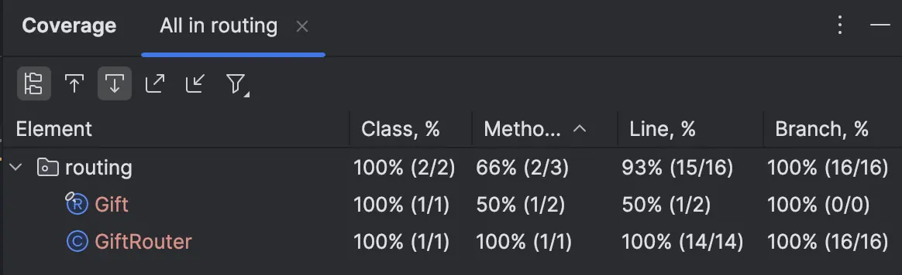
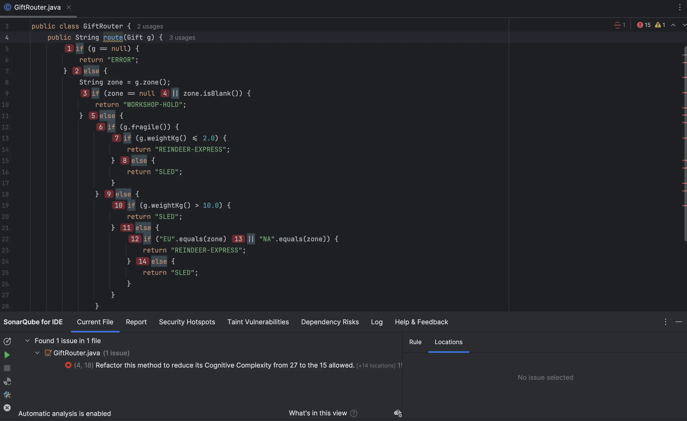
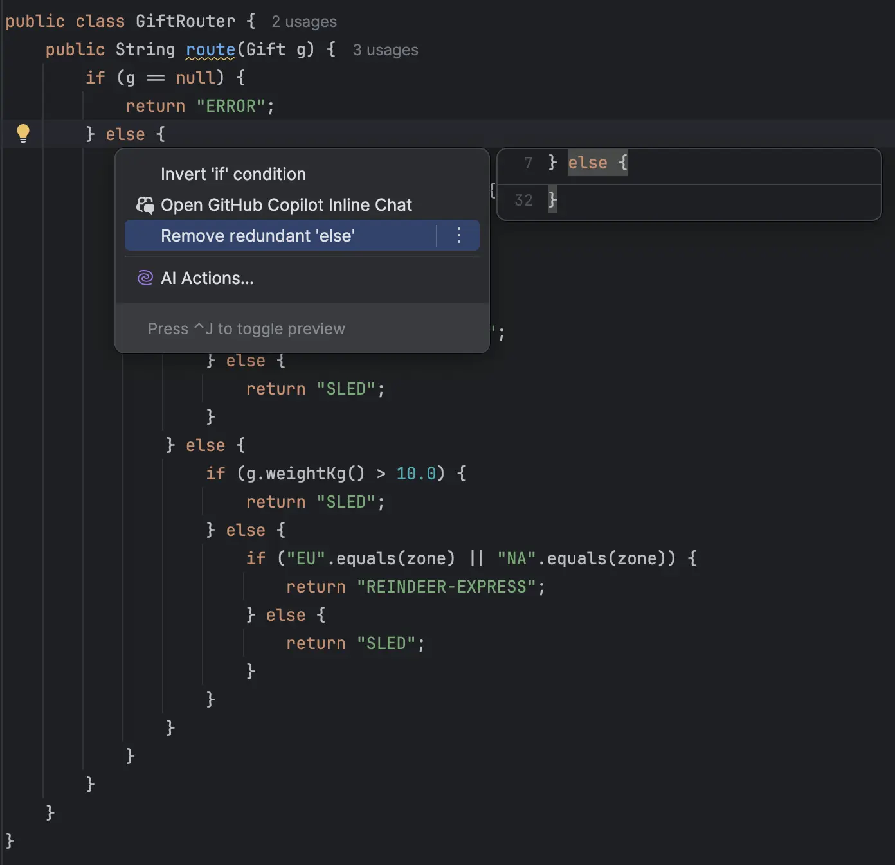
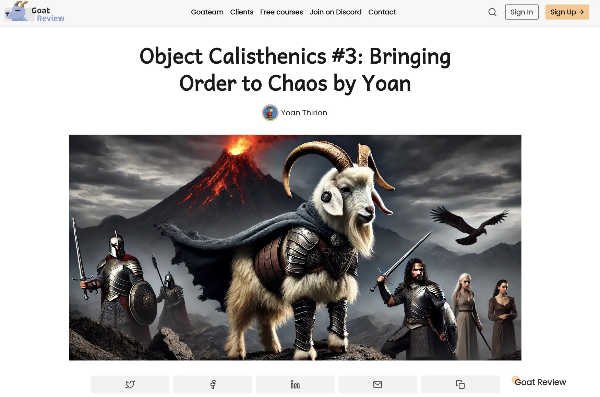

# [Jour 17 — if... elfe... refactor](https://coda-school.github.io/advent-2025/?day=17)
C'est partir pour du refactoring aujourd'hui.
On va appliquer les [Object Calisthenics](https://williamdurand.fr/2013/06/03/object-calisthenics/) :
- une **indentation max d’un niveau par méthode**
- **aucun `else`** (préférer des *guard clauses* / polymorphisme / micro-méthodes).

On doit faire attention à ne pas altérer le comportement attendu de ce programme.
On a de la chance, un file de sécurité : les **tests automatisés** sont fournis avec.

## Étape 1 : se faire une idée de la base de code
Avant de toucher à quoi que ce soit, je vérifie le `code coverage` pour m'assurer que toutes les branches sont biens couvertes.



> Nous avons bien `100%` de code coverage (line / branch) et pouvons refactorer sereinement. Vraiment ?

> Afin de nous rassurer nous pouvons utiliser le principe de [mutation testing](https://xtrem-tdd.netlify.app/Flavours/Testing/mutation-testing) à la main pour nous rassurer 😉

On jette un oeil au code avec notre `linter` et c'est pas brillant :


## Étape 2 : aucun `elfe`
On commence à appliquer les `Calisthenics` via des refactorings automatisés avec notre `IDE`.
En tout temps, on relance les tests afin de valider qu'on n'introduit pas de régression.



Après quelques raccourcis claviers, on obtient :

```java
public class GiftRouter {
    public String route(Gift g) {
        if (g == null) {
            return "ERROR";
        }
        String zone = g.zone();
        if (zone == null || zone.isBlank()) {
            return "WORKSHOP-HOLD";
        }
        if (g.fragile()) {
            if (g.weightKg() <= 2.0) {
                return "REINDEER-EXPRESS";
            }
            return "SLED";
        }
        if (g.weightKg() > 10.0) {
            return "SLED";
        }
        if ("EU".equals(zone) || "NA".equals(zone)) {
            return "REINDEER-EXPRESS";
        }
        return "SLED";
    }
}
```

## Étape 3 : un seul niveau d'indentation
On extrait une méthode afin de n'avoir qu'un seul niveau d'indentation par méthode :

```java
public class GiftRouter {
    public String route(Gift g) {
        if (g == null) {
            return "ERROR";
        }
        String zone = g.zone();
        if (zone == null || zone.isBlank()) {
            return "WORKSHOP-HOLD";
        }
        if (g.fragile()) {
            return routeFragileGift(g);
        }
        if (g.weightKg() > 10.0) {
            return "SLED";
        }
        if ("EU".equals(zone) || "NA".equals(zone)) {
            return "REINDEER-EXPRESS";
        }
        return "SLED";
    }

    private static String routeFragileGift(Gift g) {
        if (g.weightKg() <= 2.0) {
            return "REINDEER-EXPRESS";
        }
        return "SLED";
    }
}
```

## Étape 4 : appliquer la règle du Boy Scout
Il reste des éléments à nettoyer de mon point de vue :
- De nombreuses `Magic Strings` et `Hardcoded values`
- Des validations non orientés métiers (`"EU".equals(zone) || "NA".equals(zone)` par exemple)
- Trop de `if`

Je vais appliquer le principe [`Parse Don't Validate`](https://xtrem-tdd.netlify.app/Flavours/Design/parse-dont-validate) pour simplifier le code en utilisant le type [`Optional`](https://docs.oracle.com/javase/8/docs/api/java/util/Optional.html) de `java`.

```java
public class GiftRouter {
    public static final String ERROR = "ERROR";

    public String route(Gift gift) {
        return Optional.ofNullable(gift)
                .map(this::routeSafely)
                .orElse(ERROR);
    }

    private String routeSafely(Gift gift) {
        ...
    }
}
```

On utilise aussi le `Pattern matching` et finit avec le code : 
```java
public class GiftRouter {
    // Constantes
    private static final String ERROR = "ERROR";
    private static final String WORKSHOP_HOLD = "WORKSHOP-HOLD";
    private static final String SLED = "SLED";
    private static final String REINDEER_EXPRESS = "REINDEER-EXPRESS";

    private static final String EUROPE = "EU";
    private static final String N_A = "NA";

    // Utilisation d'Optional
    public String route(Gift gift) {
        return Optional.ofNullable(gift)
                .map(this::routeSafely)
                .orElse(ERROR);
    }

    // On route vers la zone ssi la zone est valide
    private String routeSafely(Gift gift) {
        return gift.isValidZone()
                ? routeToZone(gift)
                : WORKSHOP_HOLD;
    }

    // Pattern matching pour exprimer de manière claire les différents cas
    private String routeToZone(Gift gift) {
        return switch (gift) {
            case Gift g when g.fragile() -> routeFragileGift(g);
            case Gift g when g.isHeavyWeight() -> SLED;
            case Gift g when isForExpressZone(g) -> REINDEER_EXPRESS;
            default -> SLED;
        };
    }

    private static String routeFragileGift(Gift gift) {
        return gift.isLowWeight()
                ? REINDEER_EXPRESS
                : SLED;
    }

    private static boolean isForExpressZone(Gift gift) {
        return EUROPE.equals(gift.zone())
                || N_A.equals(gift.zone());
    }
}
```

De mon point de vue, les Object Calisthenics ne sont pas des règles strictes à appliquer mais une grille permettant de se questionner continuellement et prendre des décisions en consience.

Pour aller plus loin, avec des amis nous avions publié une série d'articles sur le sujet disponibles ici :
[](https://goatreview.com/object-calisthenics-9-rules-clean-code-implementation-yoan/)