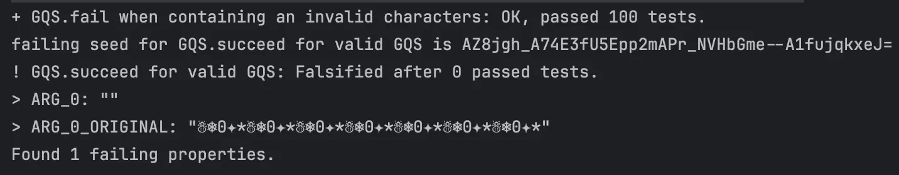
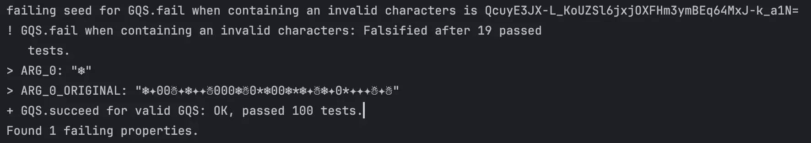

# [Jour 18 — Le mystère du GQS](https://coda-school.github.io/advent-2025/?day=18)
Il faut écrire un programme capable de convertir les données `GQS` vers décimal.
Voici la table de conversion gravée dans la glace :

| Symbol | Décimal |
|--------|---------|
| ☃      | -2      |
| ❄      | -1      |
| 0      | 0       |
| *      | +       |
| ✦      | +2      |

Le système GQS est basé sur des **puissances de 5**.
Ainsi, chaque position correspond à un multiple de 1, 5, 25, 125, 625, etc., exactement comme notre système décimal fonctionne avec les puissances de 10.

Exemple :

```
✦*0❄  =  (✦ × 125) + (* × 25) + (0 × 5) + (❄ × 1)
       =  (2 × 125) + (1 × 25) + (0) + (-1)
       =  250 + 25 - 1 = 274
```

Dans mon tour du monde des langages de programmation, je vais aujourd'hui utiliser `scala`.

## Étape 1 : parser des `GQS` invalides
🔴 je pose un premier test afin de définir un premier prototype de mon programme :
- Ici j'utilise un test de propriété et délègue à la machine la création de cas de tests aléatoires
- Plus d'explications [ici](https://xtrem-tdd.netlify.app/Flavours/Testing/pbt)

```scala
object GQSProperties extends Properties("GQS") with EitherValues {
  property("fail when containing an invalid characters") = forAll(invalidGQS) { input =>
    GQS.parseToDecimal(input) == Left(Error("Not a valid GQS 🥶"))
  }
}
```

On peut traduire ce test par :
```text
Pour n'importe quel `GQS` invalide : gqs
La fonction de parsing `parseToDecimal(gqs)` retournera toujours 1 erreur contenant comme message : "Not a valid GQS 🥶"
```

Ici j'ai un test qui en vaut 100 et qui dès qu'il sera rejoué va valider de nouvelles valeurs aléatoirement.

Afin d'avancer, je définis ce qu'est un `GQS` invalide :

```scala
object Generators {
  private val validSymbols = Set('☃', '❄', '0', '*', '✦')
  private val otherChars: Gen[Char] = Gen.oneOf(
    ('a' to 'z') ++ ('A' to 'Z') ++ ('0' to '9') ++ Seq(' ', '!', '@', '#', '$', '%', '^', '&', '(', ')', '-', '_', '=', '+')
      .filterNot(validSymbols.contains)
  )

  val invalidGQS: Gen[String] = for {
    numberOfValidSymbols <- Gen.choose(0, 100) // de manière aléatoire [0, 100] on génère x symbols valides
    numberOfInvalidSymbols <- Gen.choose(1, 5) // de manière aléatoire [1, 5] on génère y symbols invalides 
    validPart <- Gen.listOfN(numberOfValidSymbols, Gen.oneOf(validSymbols.toSeq)) // on sélectionne le nombre x de symbols valides 
    invalidPart <- Gen.listOfN(numberOfInvalidSymbols, otherChars) // on sélectionne le nombre y de symbols invalides
    combined = Random.shuffle(validPart ++ invalidPart) // on combine les 2 listes
  } yield combined.mkString // on crée un String sur base du résultat
}
```

🟢 On implémente le minimum pour faire passer ce test :

```scala
case class Error(message: String);

object GQS {
  def parseToDecimal(input: String): Either[Error, Int] = Left(Error("Not a valid GQS 🥶"))
}
```

Voici quelques exemples de `GQS` invalides générés :
```text
✦N☃6*0☃❄✦*✦*❄✦0✦❄☃✦*☃*✦✦000✦❄0❄✦✦❄0☃☃☃*✦0✦*☃*✦✦❄❄✦*0❄0❄d0✦❄0☃*❄00*☃3✦☃☃☃☃✦❄☃*
0☃*00✦*✦00**❄0✦✦☃☃☃☃❄**❄☃☃✦08*✦✦0*❄❄☃✦✦✦❄❄*0✦✦*✦✦0**❄☃✦☃❄☃☃❄☃❄0*000☃☃00❄0❄✦00❄✦☃❄✦☃*0*❄❄❄☃✦0✦0❄❄✦**✦
☃✦✦✦**-☃**0❄☃❄*h0❄✦*☃✦☃❄*☃*0☃❄✦*0☃D✦*❄**❄*✦☃☃❄✦☃0*☃*0*❄**☃☃*✦✦0❄00❄
*0*☃✦0☃✦❄❄✦✦☃❄❄✦*00✦0☃❄❄0☃*✦j0☃00✦0*❄✦00**✦✦❄0**☃❄❄✦❄00✦❄0☃❄✦0❄*❄0❄**
0✦❄0☃❄❄☃☃❄❄***✦*0✦❄0✦✦**✦❄*✦*☃✦✦✦0*❄*❄*0✦✦☃✦p❄T☃☃*❄✦*0❄**00*☃**☃*❄✦*✦☃❄❄0*✦
**☃❄❄*☃☃O✦✦*✦❄✦☃☃☃0*0☃❄❄❄✦0❄*☃☃*☃❄☃☃0❄*
A✦❄❄✦❄❄❄a❄
```

## Étape 2 : parser des `GQS` valides
🔴 J'ajoute une seconde propriété : 

```scala
property("succeed for valid GQS") = forAll(validGQS) { gqs =>
    // On va juste valider que cela retourne un succès à travers cette propriété
    GQS.parseToDecimal(gqs).isRight
}

val validGQS: Gen[String] = for {
    length <- Gen.choose(1, 10)
    gqs <- Gen.listOfN(length, validSymbols)
} yield gqs.flatten.mkString
```



🟢 On itère sur le code afin de le faire passer au vert

```scala
object GQS {
  private val validSymbolsRegex = "^[☃❄0*✦]+$".r

  def parseToDecimal(input: String): Either[Error, Int] =
    if (isValidGQS(input)) Right(0)
    else Left(Error("Not a valid GQS 🥶"))

  private def isValidGQS(input: String): Boolean = validSymbolsRegex.matches(input)
}
```

En lançant les tests plusieurs fois, on découvre que la propriété échoue désormais pour certaines valeurs :


On isole alors cette valeur pour l'analyser (on ne relance surtout pas la propriété) :
`❄✦00☃✦❄✦✦☃000❄☃0*❄00❄*❄✦☃❄✦0*✦✦✦☃✦☃` : cet input ne contient en effet que des caractères valides...

> Cela veut dire que le générateur de `GQS` invalides ne fonctionnent pas comme attendu...

C'est assez facile à détecter, j'ai fait une erreur dans la déclaration des `otherChars` : 

```diff
private val otherChars: Gen[Char] = Gen.oneOf(
- ('a' to 'z') ++ ('A' to 'Z') ++ ('0' to '9') ++ Seq(' ', '!', '@', '#', '$', '%', '^', '&', '(', ')', '-', '_', '=', '+')
+ ('a' to 'z') ++ ('A' to 'Z') ++ ('1' to '9') ++ Seq(' ', '!', '@', '#', '$', '%', '^', '&', '(', ')', '-', '_', '=', '+')
    .filterNot(validSymbols.contains)
)
```

🔵 Qu'est-ce qui peut être refactoré ici ? 🤔

## Étape 3 : ajouter des cas de tests
Afin de trianguler l'implémentation, nous allons ajouter des cas de tests d'exemple.

🔴 On ajoute un premier cas simple :

```scala
class ValidGQSTest
  extends AnyFlatSpec
    with Matchers
    with TableDrivenPropertyChecks {

  "parseToDecimal" should "return its decimal value" in {
    forAll(examples) { (gqs, expectedValue) =>
      GQS.parseToDecimal(gqs) shouldBe Right(expectedValue)
    }
  }
}

object ValidGQSTest {
  private val examples =
    Table(
      ("gqs", "expectedValue"),
      ("☃", -2)
    )
}
```

🟢 Cela nous force à changer notre implémentation (ne plus utiliser de `Regex`)

```scala
object GQS {
  private val symbolToValue: Map[Char, Int] = Map(
    '☃' -> -2,
    '❄' -> -1,
    '0' -> 0,
    '*' -> +1,
    '✦' -> +2
  )

  def parseToDecimal(input: String): Either[Error, Int] =
    if (isValidGQS(input)) Right(toDecimal(input))
    else Left(Error("Not a valid GQS 🥶"))

  private def isValidGQS(input: String): Boolean =
    input.forall(c => symbolToValue.contains(c))

  private def toDecimal(gqs: String): Int =
    gqs.map(symbolToValue).sum
}
```

🔴 On ajoute un cas plus complexe : 

```scala
object ValidGQSTest {
  private val examples =
    Table(
      ("gqs", "expectedValue"),
      ("☃", -2),
      ("❄", -1),
      ("0", 0),
      ("*", +1),
      ("✦", +2),
      ("✦*0❄", 274)
    )
}
```

Cela va nous permettre d'implémenter la logique avec les `puissances de 5`.

🟢 On implémente la logique de la manière la plus explicite possible :

```scala
  private def toDecimal(gqs: String): Int =
    var result = 0
    var power = 1
    // on parcourt la chaîne de droite à gauche
    for (i <- gqs.length - 1 to 0 by -1) {
      // on récupère la valeur associée au symbol
      val value = symbols(gqs(i))
      // on la met à la puissance 5
      result += value * power
      // on incrémente la puissance de 5 de manière posittionnelle
      power *= 5
    }
    result
```

🔵 On utilise les fonctions de base de `scala` afin de simplifier cette implémentation :

```scala
  private def toDecimal(gqs: String): Int =
    gqs.reverse
      // associe à chaque caractère sa position (index) dans la chaîne inversée
      .zipWithIndex
      // pour chaque association on applique la fonction suivante
      .map { (char, index) =>
        // on récupère la valeur du symbole courant et le multiplie par la puissance de 5 à l'index où il se trouve
        symbols(char) * Math.pow(5, index).toInt
      }.sum
```

## Étape 4 : calculer la moyenne décimale
On ajoute un test pour :
- charger le fichier `gqs`
- parser chaque ligne en `décimal`
- calculer la moyenne

```scala
  "calculate avg for gqs file" should "return -288.77" in {
    calculateAverageFor(FileUtils.readFile("gqs.txt")) shouldBe -288.7762
  }

  private def calculateAverageFor(lines: List[String]): Double =
    lines.map(GQS.parseToDecimal)
      .collect { case Right(value) => value }
      .sum.toDouble / lines.length
```

La réponse du jour est donc `-288.77`.