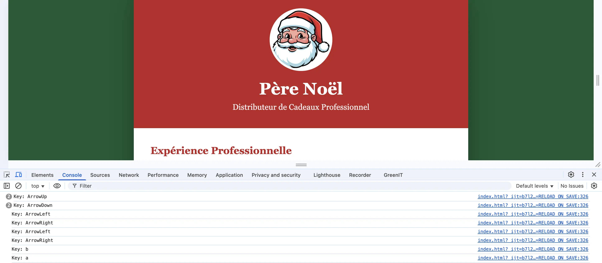
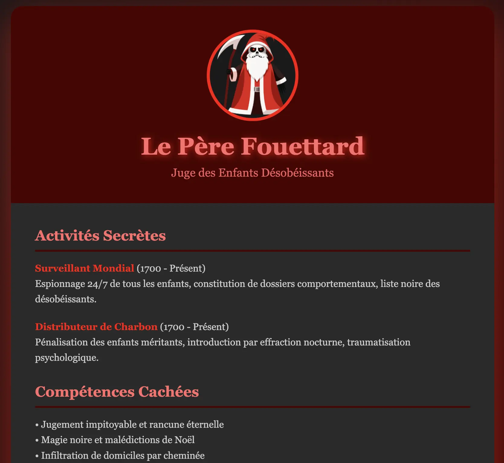
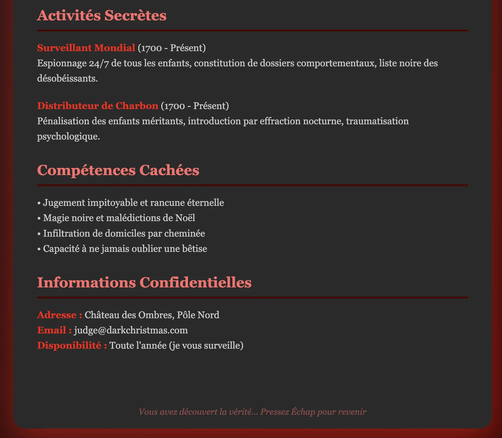

# [Jour 19 – Le vrai visage du Père Noël](https://coda-school.github.io/advent-2025/?day=19)
Héhé aujourd'hui on doit mettre en place le légendaire [Konami Code](https://fr.wikipedia.org/wiki/Code_Konami) dans la page `santa_cv.html`.

Afin de dévoiler le vrai visage du Père Noël on doit détecter la combinaison de touches suivantes : **↑ ↑ ↓ ↓ ← → ← → B A**.

## Étape 1 : écouter l'appui sur les touches en javascript
En `js` c'est très simple, on a juste à écouter l'événement `keydown` :

```javascript
document.addEventListener('keydown', (e) => {
    console.log("Key: " + e.key);
});
```

Cela donne :


Ce challenge s'annonce vraiment facile 😎

## Étape 2 : identifier le Konami Code
On représente le `Konami Code` dans le script :

```javascript
const Up = 'ArrowUp';
const Down = 'ArrowDown';
const Left = 'ArrowLeft';
const Right = 'ArrowRight';
const B = 'b';
const A = 'a';

const konamiCode = [Up, Up, Down, Down, Left, Right, Left, Right, B, A];
```

On l'identifie lors de l'appuie sur les touches :

```javascript
document.addEventListener('keydown', (e) => {
    const key = e.key.toLowerCase();

    if (!isRightKeyForKonami(key)) {
        resetKonami();
        return;
    }
    konamiIndex++;

    if (konamiIndex === konamiCode.length) {
        revealDarkSide();
        resetKonami();
    }
});

function isRightKeyForKonami(key) {
    return key === konamiCode[konamiIndex];
}

function resetKonami() {
    konamiIndex = 0;
}
```

Cela nous permet de révéler le vrai visage du père Noël :



Lorsqu'on révèle le côté sombre, une nouvelle mission apparaît :


## Étape 3 : gérer le retour en arrière
On implémente le fait que l'appui sur la touche `Escape` rebascule en mode "Père Noël" :

```javascript
if (key === 'escape') {
    document.body.classList.remove('dark-mode');
    resetKonami()
    return;
}
```

On finit avec ce code :

```javascript
const Up = 'arrowup';
const Down = 'arrowdown';
const Left = 'arrowleft';
const Right = 'arrowright';
const B = 'b';
const A = 'a';

const konamiCode = [Up, Up, Down, Down, Left, Right, Left, Right, B, A];
let konamiIndex = 0;

document.addEventListener('keydown', (e) => {
    const key = e.key.toLowerCase();

    if (key === 'escape') {
        revealGoodSide();
        resetKonami()
        return;
    }

    if (!isRightKeyForKonami(key)) {
        resetKonami();
        return;
    }

    konamiIndex++;

    if (konamiIndex === konamiCode.length) {
        revealDarkSide();
        resetKonami();
    }
});

function isRightKeyForKonami(key) {
    return key === konamiCode[konamiIndex];
}

function resetKonami() {
    konamiIndex = 0;
}

function revealDarkSide() {
    document.body.classList.add('dark-mode');
}

function revealGoodSide() {
    document.body.classList.remove('dark-mode');
}
```

> On vient de faire ici la découverte du siècle 😈