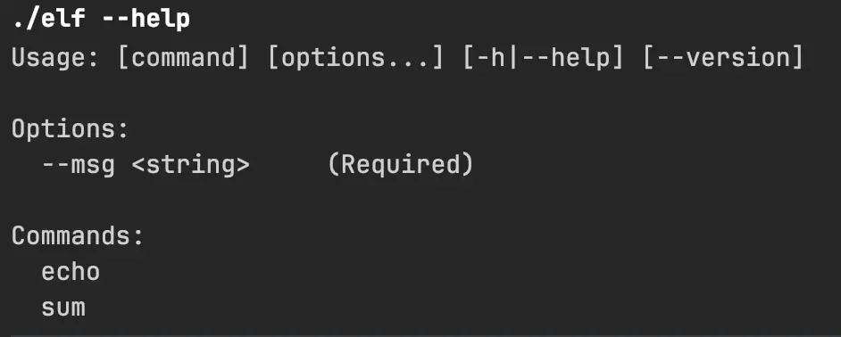
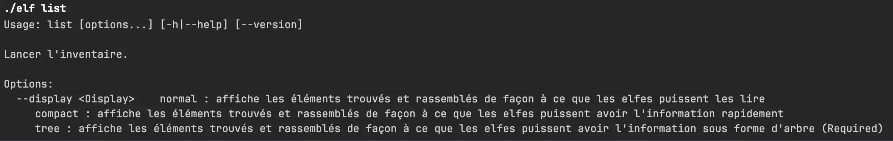
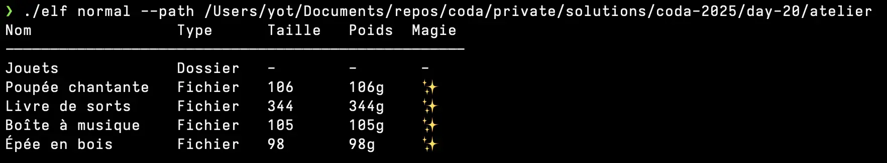
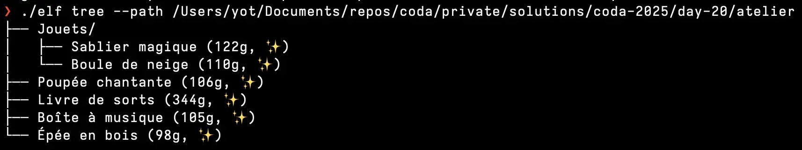
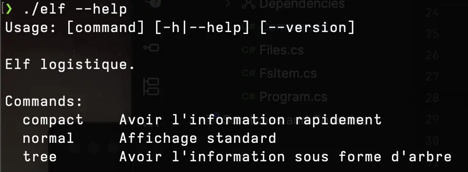

# [Jour 20 - Logistique Elfique](https://coda-school.github.io/advent-2025/?day=20)

Trop bien on va coder une nouvelle commande pour le `Terminal` des elfs.
Je vais le faire en `C#` pour profiter de la librairie [ConsoleAppFramework](https://github.com/Cysharp/ConsoleAppFramework).

Cela va permettre de le faire avec un minimum d'effort 😉

## Étape 1 : créer le squelette d'application
Pour cela, on peut s'appuyer sur la [documentation fournie](https://github.com/Cysharp/ConsoleAppFramework?tab=readme-ov-file#command) afin de créer notre commande d'inventaire :

```csharp
var app = ConsoleApp.Create();
app.Add<MyCommands>();
app.Run(args);

public class MyCommands
{
    /// <summary>Root command test.</summary>
    /// <param name="msg">-m, Message to show.</param>
    [Command("")]
    public void Root(string msg) => Console.WriteLine(msg);

    /// <summary>Display message.</summary>
    /// <param name="msg">Message to show.</param>
    public void Echo(string msg) => Console.WriteLine(msg);

    /// <summary>Sum parameters.</summary>
    /// <param name="x">left value.</param>
    /// <param name="y">right value.</param>
    public void Sum(int x, int y) => Console.WriteLine(x + y);
}
```

En quelques secondes, on obtient quelque chose à partir duquel commencer.

Visuellement, cela donne ça :


La librairie gère pour nous le parsing des `arguments` et la `documentation` 💪

On itère une première fois sur le code afin de préparer le terrain pour notre `ls` elfique :

```csharp
App().Run(args);
return;

static ConsoleAppBuilder App()
{
    var consoleAppBuilder = Create();
    consoleAppBuilder.Add<Commands>();

    return consoleAppBuilder;
}

public class Commands
{
    /// <summary>Elf logistique.</summary>
    [Command("")]
    public void Root() => Console.WriteLine();

    /// <summary>
    /// Lancer l'inventaire. 
    /// </summary>
    /// <param name="display"></param>
    public void List(Display display) => Console.WriteLine(display);
}

public enum Display
{
    Normal,
    Compact,
    Tree
}
```

Notre `CLI` ressemble désormais à cela :


## Étape 2 : parcourir les fichiers
On peut créer le code permettant de représenter le contenu d'un répertoire donné :

```csharp
public static class Files
{
    public static FsItem InfosFor(string? path = null)
    {
        var directory = new DirectoryInfo(
            string.IsNullOrEmpty(path)
                ? Directory.GetCurrentDirectory()
                : path
        );
        return FsItemFor(directory, ChildrenFor(directory));
    }

    private static FsItem[] ChildrenFor(DirectoryInfo directory) =>
        DirectoriesFor(directory)
            .Concat(FilesFor(directory))
            .ToArray();

    private static IEnumerable<FsItem> DirectoriesFor(DirectoryInfo directory)
        => directory
            .GetDirectories()
            .Select(dir => FsItemFor(dir, ChildrenFor(dir)));

    private static IEnumerable<FsItem> FilesFor(DirectoryInfo directory)
        => directory
            .GetFiles()
            .Select(FsItemFor);
}

public class FsItem
{
    private FsItem(
        string name,
        string fullPath,
        bool isDirectory,
        long size,
        DateTime lastModified,
        FsItem[] children)
    {
        Name = name;
        FullPath = fullPath;
        IsDirectory = isDirectory;
        Size = size;
        LastModified = lastModified;
        Children = children;
    }

    public string Name { get; }
    public string FullPath { get; }
    public bool IsDirectory { get; }
    public long Size { get; }
    public DateTime LastModified { get; }
    public FsItem[] Children { get; }

    public static FsItem FsItemFor(DirectoryInfo info, FsItem[] children) =>
        new(info.Name, info.FullName, true, 0, info.LastWriteTime, children);

    public static FsItem FsItemFor(FileInfo info) =>
        new(info.Name, info.FullName, false, info.Length, info.LastWriteTime, []);
}
```

## Étape 3 : implémenter les commandes
On implémente chaque commande indépendamment en commençant par `normal` :

```csharp
/// <summary>
/// Affichage standard
/// </summary>
/// <param name="path"></param>
public void Normal(string? path = null)
    => PrintInfosFor(
        path,
        items =>
        {
            var builder = new StringBuilder();
            builder.AppendLine("Nom                Type      Taille   Poids  Magie");
            builder.AppendLine("---------------------------------------------------");

            items.Select(item =>
                {
                    var name = item.Name.PadRight(16)[..16];
                    var type = item.IsDirectory ? "Dossier" : "Fichier";
                    var size = item.IsDirectory ? "-" : item.Size + "";
                    var weight = item.IsDirectory ? "-" : $"{item.Size}g";
                    var magic = item.IsDirectory ? "-" : StarsFor(item.Size);

                    return $"{name}   {type,-9} {size,-8} {weight,-7} {magic}";
                })
                .ToList()
                .ForEach(line => builder.AppendLine(line));

            return builder.ToString();
        });
```

Ce qui donne :



On enchaine avec la version `compact` :

```csharp
/// <summary>
/// Avoir l'information rapidement
/// </summary>
public void Compact(string? path = null)
    => PrintInfosFor(
        path,
        items => string.Join(", ",
            items.Select(item => item.IsDirectory
                ? $"{item.Name}/"
                : $"{item.Name} ({item.Size}g, {StarsFor(item.Size)})"
            )
        ));
```

Ce qui donne :


On finit avec la version `tree` :

```csharp
/// <summary>
/// Avoir l'information sous forme d'arbre
/// </summary>
public void Tree(string? path = null) => PrintInfosFor(
    path,
    items => TreeFor(items)
);

private static string TreeFor(FsItem[] items, string indent = "")
{
    var builder = new StringBuilder();
    for (var i = 0; i < items.Length; i++)
    {
        var isLast = i == items.Length - 1;
        var prefix = isLast ? "└── " : "├── ";
        builder.Append(indent + prefix);

        if (items[i].IsDirectory)
        {
            builder.AppendLine($"{items[i].Name}/");
            builder.Append(TreeFor(items[i].Children, indent + (isLast ? "    " : "│   ")));
        }
        else
        {
            var weight = $"{items[i].Size}g";
            var stars = StarsFor(items[i].Size);
            builder.AppendLine($"{items[i].Name} ({weight}, {stars})");
        }
    }
    return builder.ToString();
}
```

Ce qui donne :



En ce qui concerne la commande `help`, elle est auto-générée et ressemble à :



C'est sensiblement ce que les `elfs` attendent.
On peut espérer qu'ils aimeront le rendu final.