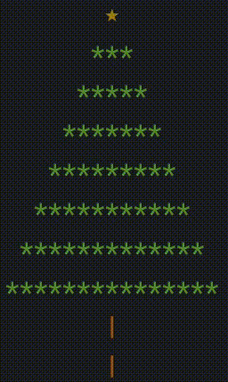

# [Jour 22 — ASCII paraît, on installe le sapin ?](https://coda-school.github.io/advent-2025/?day=22)
On doit monter le sapin de Noël aujourd'hui.
Ça sent la fin de ce calendrier de l'Avent et le rapprochement de Noël. 

Voici ce que les elfes attendent de nous :
- Affiche un sapin de Noël avec des épines (vert) avec un tronc en bois (marron)
- Ajoute des décorations de couleur (jaune, rouge, bleu, ...)
- Ajoute des guirlandes animées

Je dois avouer avoir bien cravaché les autres jours et vais appliquer un des principes du [Manifeste Agile](https://manifesteagile.fr/) :
> La simplicité – l’art de maximiser la quantité de travail qu’on ne fait pas – est essentielle. 😉

Voici le résultat :



J'ai codé ce petit arbre (`hardcodé` je l'avoue) en `typescript` :

```typescript
const clearConsole = (): void => console.clear();
const displayStar = (): void => console.log(colors.yellow + "        ★        " + colors.reset);
const guirlandColorAt = (lineIndex: number): string =>
    lineIndex % 2 === 0 ? colors.red : colors.blue; // Cocorico à la 🇫🇷

const mergeLineWithGuirland = (line: string, guirlandLine: string, color: string): string =>
    line.split('')
        .map((char, i) => guirlandLine[i] === '•' ? color + '•' + colors.reset : char)
        .join('');

const mergeLine = (line: string, i: number) =>
    showGuirlands && i < guirlands.length
        ? mergeLineWithGuirland(line, guirlands[i], guirlandColorAt(i + 1))
        : colors.green + line + colors.reset;

const displayCrown = (): void =>
    treeLines.slice(1) // Skip first line (replaced by star)
        .map((line, i) => mergeLine(line, i))
        .forEach(mergedLine => console.log(mergedLine));

const displayTrunk = (): void => {
    console.log(colors.brown + "        |        " + colors.reset);
    console.log(colors.brown + "        |        " + colors.reset);
};

const displayTree = (): void => {
    clearConsole();
    displayStar();
    displayCrown();
    displayTrunk();
};

let showGuirlands = true;
setInterval(() => {
    showGuirlands = !showGuirlands;
    displayTree();
}, 1000);

displayTree();
```